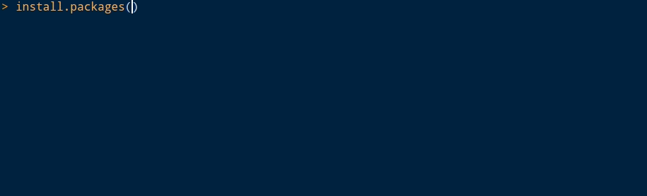

```{r setup, include = FALSE}
```

[リリースノート](//www.rstudio.com/products/rstudio/release-notes/)にも載っていない RStudio 1.2.x の世界

> ん？install.packagesするとき、ライブラリ名が補完される・・・？？？

という [\@niszet0](//twitter.com/niszet0) 氏の [投稿](https://x.com/niszet0/status/1129251313668173827) を発端に確認．

なぜか私が纏めることに．



上の画像のように，パッケージ名を引用符で**囲わずに**入力し始め，tab キーを押すと幸せになれる．

パッケージの説明については，インストール済みの場合のみ見れるようだ．

残念ながら以下のように，`c()` で囲った中にパッケージ名を書き出しても，
パッケージ名を補完することはできない．

```.r
install.packages(c(tid))
```

`pacman` パッケージや `pak` パッケージなど，パッケージの管理を便利にしてくれる
パッケージでも利用できるといいが，まあ難しいだろうことは想像に固くない．

ちなみに GitHub 上のパッケージをインストールしたいけど，
ユーザー名やパッケージ名があやふやな時には `githubinstall` パッケージが便利です
(参考: <https://www.karada-good.net/analyticsr/r-341>)．
