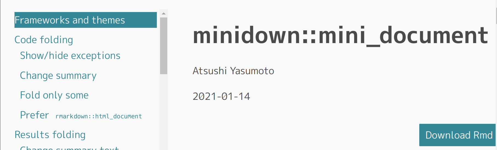

`minidown::mini_document`は`rmarkdown::html_document`を軽量化しつつ同等以上の機能提供を目指すR Markdown用HTMLフォーマットです。

どんなことができるかは以下を参照してください。
実際に`minidown::mini_document`を使ってレンダリングした結果なので、雰囲気がよくわかると思います。

> https://minidown.atusy.net/

また、インストールは以下のコマンドで行います。
CRANからもインストールできますが、本記事の内容はまだ反映されていません。

```r
require(devtools)
install_github("atusy/minidown")
```

さて、本題です。
今回、下図のようにクリックした目次やスクロール先のセクションに追随して、
目次をハイライトする機能を実装しました。

{style="width:100%"}
`rmarkdown::html_document(toc = TRUE, toc_float = TRUE)`と同等の機能ですね。
利用するには以下のようにYAMLフロントマターを記述します。

```yaml
output:
  minidown::mini_document:
    toc: true
    toc_float: true
    toc_highlight: true
```

Enjoy!

# 実装の話

`rmarkdown::html_document`の`floating_toc`は[Tocify](http://gregfranko.com/jquery.tocify.js/)というJavaScript製プラグインを用いています。

`minidown::mini_document`では目次のfloatingをHTMLとCSSだけで行っています。
主要な技術は2つでしょうか。

- CSS Grid Layoutにより、ウィンドウ幅に応じたレイアウトの変更
- CSSの`position: sticky`により、目次を左側に固定

`rmarkdown::html_document`に倣ってfloating tocと称していますが、実態はsticky tocと言った方が妥当かも知れませんね。
CSS Grid Layoutをうまく使えるよう、Pandocのテンプレートにも手を加えてあります。

> CSSのソースコード \
> https://github.com/atusy/minidown/blob/41e4b5122fce4aae0b2d1224ee5c393a5e8dc82e/inst/rmarkdown/html/styles/feat-toc-float.css

minidown版floating tocは軽量な一方、所詮はHTML+CSSなので、レスポンシブにも限度があります。
仕方ないのでハイライト部分はJavaScriptでフルスクラッチしました。

1. 目次のリンクから各セクションのIDを取得する
1. 目次をハイライトする時の書式をCSSルールとして追加
    1. 目次の先頭にあるリンクの背景色と文字色を取得
    1. `highlight`クラスに背景色と文字色を反転させるルールをDOMに追加
1. IDを元に各セクションの現在位置を取得し、画面最上部にあるセクションに`highlight`クラスを付与する。他のリンクからは同クラスを削除する。
    1. 関数として定義し、一度は実行して初期化しておく
    1. `window.addEventListner("scroll", ...)`といった具合にページスクロールに反応して関数を実行しハイライト箇所を随時更新する。

> JavaScriptのソースコード \
> https://github.com/atusy/minidown/blob/41e4b5122fce4aae0b2d1224ee5c393a5e8dc82e/inst/rmarkdown/html/highlightToC/highlightToC.js

ちなみにスクロールイベントは大量に発生し、パフォーマンスに影響しやすいので、

> Intersection Observer API \
> https://developer.mozilla.org/ja/docs/Web/API/Intersection_Observer_API

なるものを使うと良いそうです。
その内こちらで再実装したいですね。

今度こそEnjoy!!
