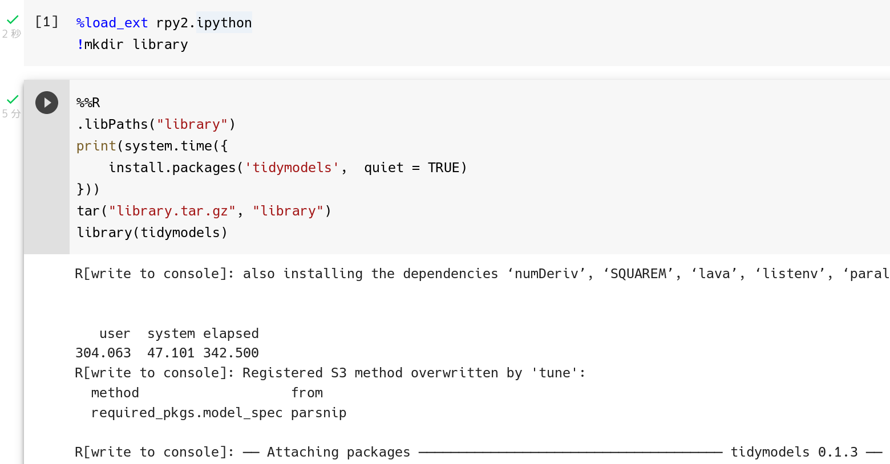
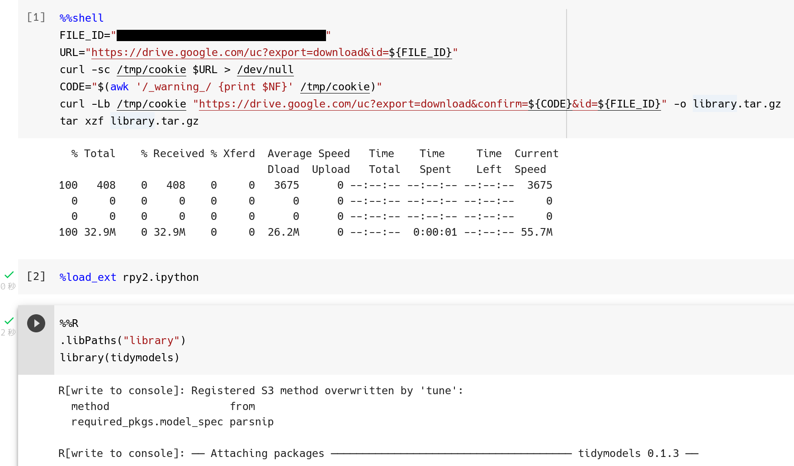

```{css, echo=FALSE}
.figure img {
  width: 100%;
}
.caption {
  font-size: 0.8em;
  color: gray;
}
```

Google ColabでRを使う場合、パッケージのインストールに時間がかかるところが悩みのタネです。
たとえばtidymodelsパッケージをインストールすると、それだけで5分かかります。
一定時間が経過すると、ノートブックの実行環境が初期化されるため、何度も待ち時間が発生します。

そこで今回はパッケージの再インストールを爆速にする方法を紹介します。
愚直に再インストールするとtidymodelsパッケージなら再び5分かかるところが1秒ほどに短縮できます。
ただし、紹介する方法は、Colabのシステム側の更新が起きるとエラーを発生する可能性があります。
問題が起きたら、面倒ですがその都度、手順を1からやり直してください。

おおまかな手順としては以下の通りです。
ノートブックの内容詳細とスクショを後述します。

1. [パッケージインストール専用のノートブック](#install)
    1. `.libPaths("library")`などとして、空のディレクトリを追加パッケージのインストール先に設定する
    1. パッケージをインストールする
    1. `tar("library.tar.gz", "library")`などとして、パッケージをインストールしたディレクトリを圧縮ファイルにする
    1. 圧縮ファイルをダウンロードする
1. Google Drive
    1. 圧縮ファイルをGoogle Driveにアップロードする
    1. 圧縮ファイルのダウンロードリンクを取得する
        - 「リンクを知っている人全員」にアクセスを許可する
        - リンクを他者に共有する場合、ライセンスの問題を各自で解決すること
1. [分析用ノートブック](#analysis)
    1. シェルスクリプトを使ってGoogle Drive上の圧縮ファイルをダウンロード・展開する
    1. `.libPaths("library")`などとして展開したディレクトリからパッケージを読み込めるようにする
    1. `library(tidymodels)`などとしてパッケージを読み込み

# パッケージインストール専用のノートブック {#install}



まず、以下のコードを実行して、Colab上でRを実行可能にしておきましょう。
加えてパッケージのインストール先となる `library` ディレクトリを作成します。

```
%load_ext rpy2.ipython
!mkdir library
```

次にパッケージのインストールと`library`ディレクトリの圧縮を行います。
`%load_ext rpy2.ipython`コマンドでRを利用可能にした場合、R言語のセルは冒頭に`%%R`が必要な点に注意してください。

``` r
%%R
.libPaths("library")
install.packages('tidymodels')
tar("library.tar.gz", "library")
```

`library.tar.gz`ファイルは、Colabの左にあるメニューのファイル一覧からダウンロードしてください。

# 分析用ノートブック



まずは「[DriveのURLからデータを直接ダウンロード](https://qiita.com/IsHYuhi/items/e4afc0163019343d9664)」を参考に
Google Drive上にあるインストールしたパッケージを圧縮したファイルを入手し、
このノートブック上で使えるようにします。

Google Driveで取得した共有用URL、ファイルIDを取得します。
URLは以下のような形式になっているはずで、`<file_id>`に相当する文字列部分がファイルIDです

```
https://drive.google.com/file/d/<file_id>/view?usp=sharing
```

そして、セルに以下のシェルスクリプトを記述します。
この時、`FILE_ID`変数に先ほど取得したファイルIDを代入してください。
値は二重引用符で囲う点と、変数名と値の間の`=`にはスペースを挟まない点に注意してください。

``` bash
%%shell
FILE_ID="<file_id>"
URL="https://drive.google.com/uc?export=download&id=${FILE_ID}"
curl -sc /tmp/cookie $URL > /dev/null
CODE="$(awk '/_warning_/ {print $NF}' /tmp/cookie)"
curl -Lb /tmp/cookie "https://drive.google.com/uc?export=download&confirm=${CODE}&id=${FILE_ID}" -o library.tar.gz
tar xzf library.tar.gz
```

これを実行すると、`library`ディレクトリが展開され、中に別のノートブックでインストールしたパッケージが詰め込まれています。

あとはRを利用可能な状態にするセルを実行し、`library`ディレクトリから必要なパッケージを読み込みます。

```
%load_ext rpy2.ipython
```

``` r
%%R
.libPaths("library")
library(tidyverse)
```