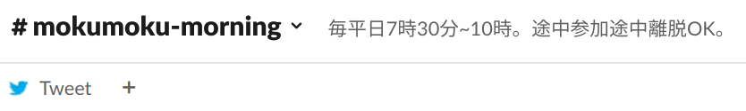

Slackではチャンネル上部に関連ページへのリンクを設置できます。

> [メッセージと関連ページのリンクをピン留めする](https://slack.com/intl/ja-jp/help/articles/205239997-%E3%83%A1%E3%83%83%E3%82%BB%E3%83%BC%E3%82%B8%E3%81%A8%E9%96%A2%E9%80%A3%E3%83%9A%E3%83%BC%E3%82%B8%E3%81%AE%E3%83%AA%E3%83%B3%E3%82%AF%E3%82%92%E3%83%94%E3%83%B3%E7%95%99%E3%82%81%E3%81%99%E3%82%8B)

この機能を使って以下のように、TweetボタンをOsaka.R Slackの朝もくチャンネルに設置しました。

{style='width:100%'}

ボタンをクリックすると、以下のように、テンプレート化したテキストをツィートできます。
もちろん、朝もくでやる内容など、コメントを追加してもOK。

{style='width:100%'}

Tweet用のURLはRで作成しました。
以下のコードの`URL`変数と`TEXT`変数を調整すると、ご所望のページへのリンクとテキストをテンプレート化したツィート生成リンクを作れます。

```{r}
URL = "https://osaka-r.connpass.com"
TEXT = "#OsakaR 朝もく"

sprintf(
  "https://twitter.com/intent/tweet?url=%s&text=%s",
  URLencode(URL, reserved = TRUE),
  URLencode(TEXT, reserved = TRUE)
)
```

`URLencode`関数はURL上で特殊文字を文字列として使いたい時のものです。
`reserved = TRUE`を指定すると、徹底的にやってくれます。
たとえば`/`はURLで特殊な意味を持ちますが、この関数を使うと`` `r URLencode('/', reserved = TRUE)` ``になります。

**Enjoy!!**
