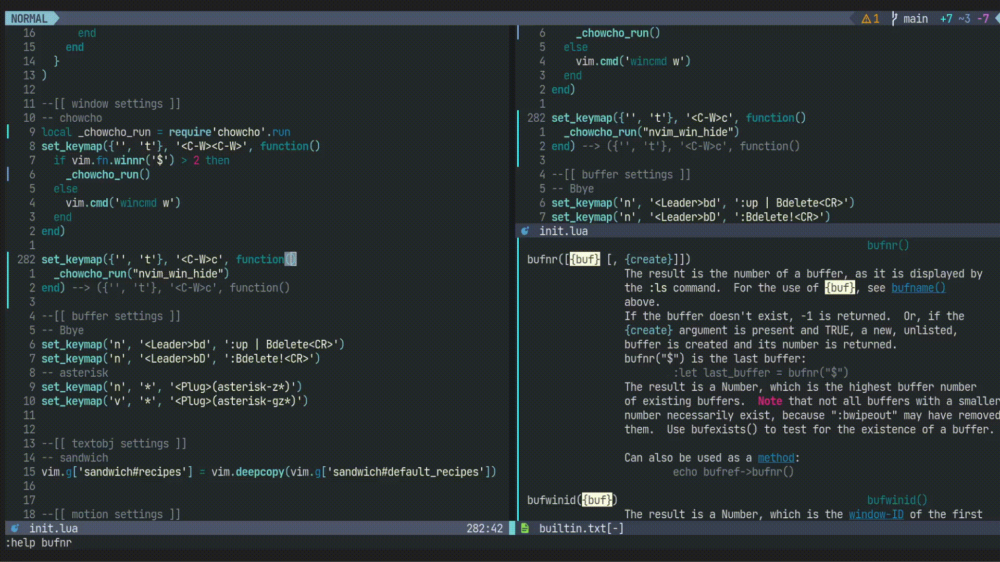

chowcho.nvimを使うと、Neovimの各windowに番号が表示され、目的番号を入力すると、フォーカスを移動できます。

https://github.com/tkmpypy/chowcho.nvim

今回、この機能を一般化し、winidを受け取る任意の関数を実行できるようにしました。

PRを無事にマージしてもらえたので、どなたでもご利用頂けます。

以下にいくつか例を載せます。

## 選択したwindowを非表示にする

``` lua
require('chowcho').run(vim.api.nvim_win_hide)
```




(動画GIF内のコードはマージ前の古いものなので、雰囲気だけお楽しみください)

## 選択したwindow上のバッファを現在のwindowで開く

`<C-W>e`にマップしています。

``` lua
vim.keymap.set({'', 't'}, '<C-W>e', function()
  if vim.fn.winnr('$') <= 1 then return end
  require('chowcho').run(function(n)
    vim.cmd("buffer " .. vim.api.nvim_win_call(n, function()
      return vim.fn.bufnr('%')
    end))
  end)
end)
```

## 選択したwindowと現在のwindowでバッファを交換する

`<C-W>x`にマップしています。

元々の`<C-W>x`はカウントに指定した番号のwindowと現在のwindowを入れ替えます。
しかし、同じ方向に分割したwindow同士でしか交換できないのは不便に感じていました。

Windowの数が2以下の場合は`wincmd x`が発動します。

3以上の時の動作は`buffer`コマンドを使っていますが、加えてバッファローカルなオプションも引き継ぐようにしています。
特にreadonlyなバッファを`buffer`コマンドで開くと、編集可能になるので、これを防ぐ狙いです。

``` lua
local _chowcho_run = require'chowcho'.run
local _chowcho_bufnr = function(winid)
  return vim.api.nvim_win_call(winid, function()
    return vim.fn.bufnr('%'), vim.opt_local
  end)
end
local _chowcho_buffer = function(winid, bufnr, opt_local)
  return vim.api.nvim_win_call(winid, function()
    local old = _chowcho_bufnr(0)
    vim.cmd("buffer " .. bufnr)
    vim.opt_local = opt_local
    return old
  end)
end

vim.keymap.set({'', 't'}, '<C-W>x', function()
  _chowcho_run(function(n)
    if vim.fn.winnr('$') <= 2 then
      vim.cmd("wincmd x")
      return
    end
    local bufnr0, opt_local0 = _chowcho_bufnr(0)
    local bufnrn, opt_localn = _chowcho_buffer(n, bufnr0, opt_local0)
    _chowcho_buffer(0, bufnrn, opt_localn)
  end)
end)
```