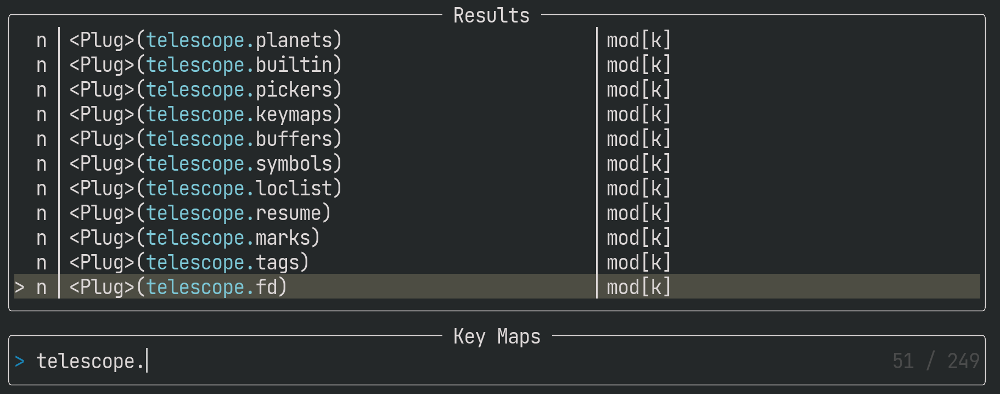
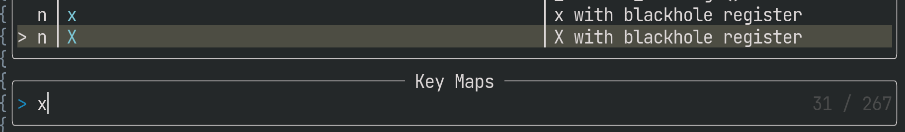
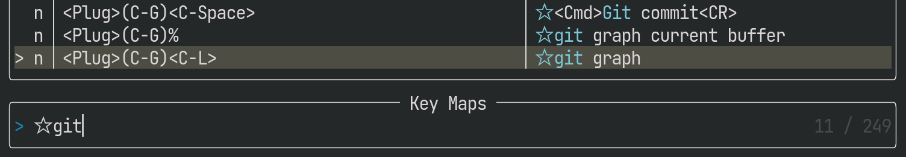

[telescope.nvim]はキーマップ、Exコマンド、ファイルなどを検索・活用するためのNeovim用プラグインです。

この内、キーマップ（`:Telescope keymaps`）の主な用途は忘れてしまったマッピングの検索でしょう。
実は、`<Plug>`系のマッピングを実際のキー入力にアサインせずとも使えるので、滅多に使わない機能へ簡単にアクセスする方法として便利です。

この方法については[Fuzzy Finderで捗るFernによるファイル操作](Fuzzy Finderで捗るFernによるファイル操作)でも紹介しました。

本稿では`:Telescope keymaps`を使って簡易的ながら汎用なコマンドパレットを構築する方法を紹介します。

# `:Telescope keymaps`のコマンドパレット化

## `<Plug>`マッピングを自前で定義

`:Telescope keymaps`はマッピングを検索・実行できるので、自前で様々なマッピングを用意してやれば、簡単にランチャー化できます。
しかし、まじめにマッピングすると、重複なく直感的なキー入力を考える必要があり、コストが高い方法です。

しかし、`<Plug>`系マッピングの検索・実行が可能な点を考慮すると可能性が広がります。
たとえば私は、`telescope.builtin`に含まれるすべての関数を`<Plug>(telescope.*)`という名前で登録しています。
そして`:Telescope keymaps`で「telescope」を検索すると以下のように絞り込めます。



上記と同等のことは以下のExコマンドの`:Telescope Builtin`でも実行できますが、`:Telescope keymaps`をより汎用的なコマンドパレット化できるので気に入ってます。
`<Plug>`マッピングの登録は以下の通り`for`文で行っています。

``` lua
for k, v in pairs(require("telescope.builtin")) do
  if type(v) == "function" then
    vim.keymap.set('n', '<Plug>(telescope.' .. k .. ')', v)
  end
end
```


## マッピングに説明文（desc）を追加

`:Telescope keymaps`を使ったコマンドパレットは便利ですが、マッピングによっては検索性に難があります。

たとえば、`<Plug>`以外のマッピングは検索しにくい場合があります。
私は`x`で文字を消す時はblack hole registerを使っています。
もし、検索してマッピングを探したくなったら何をキーワードにすればいいでしょうか？

``` lua
vim.keymap.set({ 'n', 'v' }, 'x', '"_x')
```

`<Plug>`を組み合わせてマッピングしていれば検索性は若干向上しますが、設定が冗長になります。

``` lua
vim.keymap.set({ 'n', 'v' }, '<Plug>(x-with-blackhole-register)', '"_x')
vim.keymap.set({ 'n', 'v' }, 'x', '<Plug>(x-with-blackhole-register)')
```

加えて、`<Plug>`を使ったマッピングは文字数制限にひっかかりやすい問題や、半角スペースが検索時に`<Space>`と表示される問題があります。
後者はsnake_caseやkebab-caseなどで単語を区切る手もありますが、スペースの方が読み易い人も多いでしょう。

このような場合にマッピングに説明文をつけると便利です。

``` lua
vim.keymap.set({ 'n', 'v' }, 'x', '"_x', {desc = "x with blackhole register"})
vim.keymap.set({ 'n', 'v' }, 'X', '"_X', {desc = "X with blackhole register"})
```

すると、検索画面の右側に`desc`に指定した説明文が表示されるようになります。
`desc`が未指定の場合は、`"_x`など、rhsに相当する文字列が表示されます。



## 検索候補を事前に絞り込み

ここまでの設定で`:Telescope keymaps`をコマンドパレット化できました。
しかし、プラグイン由来のマッピングも含めて検索すると煩わしいかもしれません。

その場合、先述の`desc`に特別なキーワードを入れて絞り込みしやすくするといいでしょう。
私は`☆`を入れています。

加えて、マッピング経由で検索を開始する時は自動で`☆`で絞り込む設定が便利です。

``` lua
vim.keymap.set('n', 'mm', function()
  require('telescope.builtin').keymaps()
  vim.cmd("normal! i☆")
end)
```

これなら、起動直後にバックスペースで一字消すだけで、`☆`をつけていない検索候補にもアクセスできます。



# `:Telescope commands`のコマンドパレット化

`:Telescope commands`ではユーザー定義のコマンドを検索・実行できるので、コマンドパレットとしての活路があります。
マッピングと同様に`desc`の設定・検索も可能です。
しかし、`commands`を使うといくつか難があり、私は`keymaps`を採用しました。

- コマンドパレット向けのコマンド定義がcmdlineの補完候補を汚染しうる
- コマンドパレットからの実行がhistoryを汚染しうる
- コマンドライン補完があるので、そもそも`:Telescope commands`をほとんど使わない

# Enjoy!

[telescope.nvim]: https://github.com/nvim-telescope/telescope.nvim
