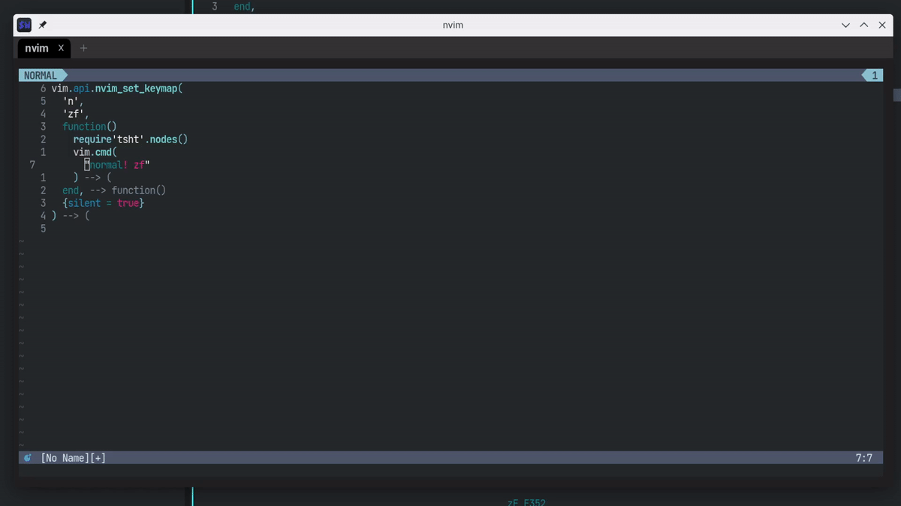

[nvim-treehopper](https://github.com/mfussenegger/nvim-treehopper)を使うと、ソースコードの抽象構文木に基づいた範囲選択が簡単にできます。

関数定義全体を選択とか、`if`文の条件部分を選択とか、文脈に沿った範囲選択が捗るわけです。

おそらく、定番の使い道は選択範囲の削除（`d` | `D`)やヤンク（`y` | `Y`）でしょう。
加えてコードの折り畳み（`zf`）とも相性が良いとに気付きました。



ノーマルモードでは`zf{motion}`と、モーションで移動した範囲に対して折り畳みを実行するので、使い勝手が悪く感じます。

そこで、以下のように`zf`をマッピングしてあげると、モーションの変わりにnvim-treehopperで折り畳み範囲を決定できます。

``` lua
vim.api.nvim_set_keymap(
  'n',
  'zf',
  function()
    require'tsht'.nodes()
    vim.cmd("normal! zf")
  end,
  {silent = true}
)
```

`:help zf`にある通り、`zf`は`foldmethod`オプションが "manual" か "marker" の時しか、使えませんので、ご注意下さい。


**Enjoy!!**
