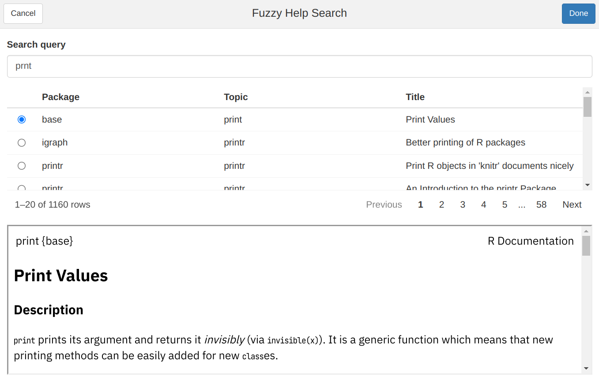
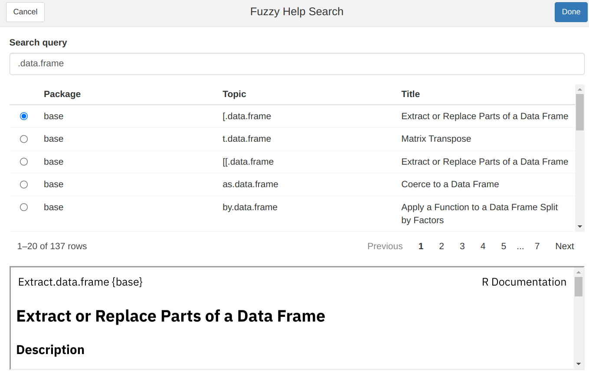
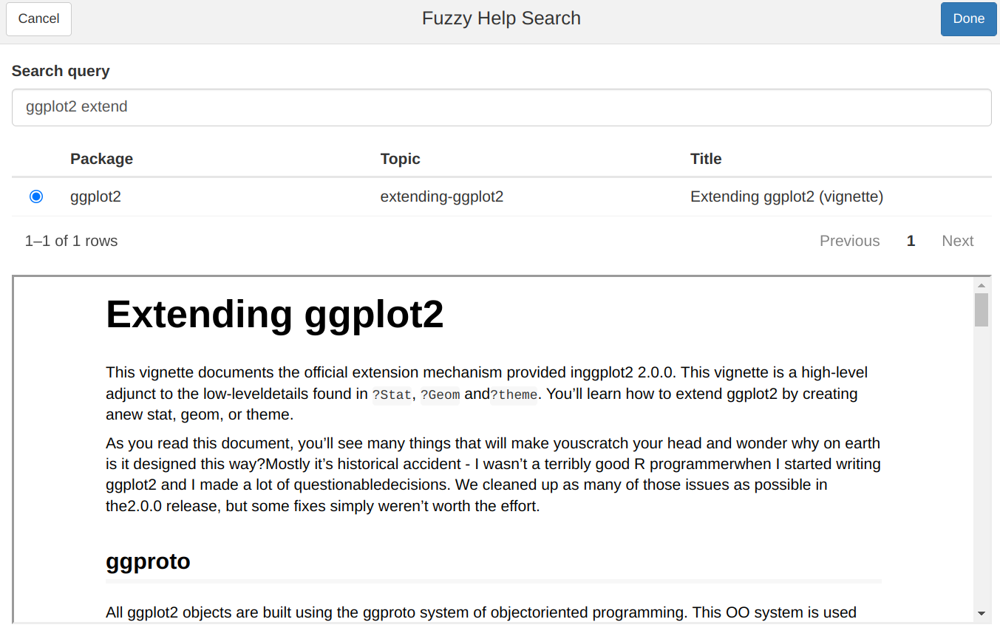

```{r, include=FALSE}
knitr::opts_chunk$set(collapse = TRUE, comment = "#>")
```

Rでヘルプを見ようにも記憶があいまいだったり、つづりがあやふやで調べようがない経験があるかもしれません。

- tidyverseに入ってるなんちゃらパッケージのミュータントみたいな関数、なんだっけ？
- `geom_lime`とか`geom_pint`ってライムもビールも欲しいけどそうやないんや！[^geomlime]


[^geomlime]: よくあるタイポとのことで、ジョークパッケージ化されてます <https://github.com/coolbutuseless/geomlime>


そこで、あいまいな（fuzzy）キーワードでヘルプを検索する`fuzzyhelp`関数をfelpパッケージに追加しました。

詳しい使い方は[後述](#howto)しますが、`felp::fuzzyhelp()`を実行するか、コマンドパレットを<kbd>Ctrl</kbd>+<kbd>Shift</kbd>+<kbd>P</kbd>で開き「Fuzzy Search on R Help」を指定すればすぐに使い始められると思います（参考：[RStudioが生産性を高める［前編］〜コマンドパレットによる検索の効率化](https://gihyo.jp/article/2022/09/increase-productivity-of-r-01)）。

ぜひ、CRANからfelpパッケージをインストールして使ってみてください。

```r
install.packages("felp")
```

## デモ


### あいまいなキーワードによる検索



あいまい検索で有名なfzfアルゴリズムをカスタムしたものを採用しています。

`print`に対して`prnt`など、打ち漏らしを許容するアルゴリズムなので、自信のある部分だけを入力して絞り込むといいでしょう。
打ち間違えはNGなので、`print`に対して`plint`はマッチしません。

### S3メソッドの検索



`class`関数を使ってオブジェクトのクラスを調べておくと、そのオブジェクト向けに定義されたS3メソッドの検索も簡単です。
`data.frame`クラスであれば、`.data.frame`と検索してみてください。

クラスとかS3メソッドとはなんぞやという方は以下の説明を読んでください。

<details><summary>S3オブジェクト指向とヘルプの関係</summary>

Rの関数の中には、与えたオブジェクトの種類（`class`）に応じて挙動を変えるものがいます。

`print`関数がその代表です。

たとえば`data.frame`関数は**data.frame**クラスのデータフレームを作成します。
また、作成したオブジェクトを確認すると、見慣れた表状のデータが表示されます。

```{r, include=FALSE}
set.seed(1)
```

```{r}
# data.frameクラス

# データ作成
x_df <- data.frame(a = runif(5), b = seq(5))

# クラスを確認
print(class(x_df))

# データ表示
print(x_df)
```

これを、`tibble::as_tibble`関数でTidyverse版データフレームに変換すると、各列の値こそ変わりませんが、表示内容は変わります。

- 1行目にデータが5行2列のtibbleであると表示（`# A tibble: 5 × 2`）
- 列名前の下に列ごとのデータの型を表示（`<dbl>`、`<int>`など）
- 小数点の表示桁数が減る

```{r}
# tbl_dfクラス

# データ変換
x_tbl <- tibble::as_tibble(x_df)

# 変換前のデータとの同一性を確認
print(x_df == x_tbl)

# クラスを確認
print(class(x_tbl))

# データ表示
print(x_tbl)
```

この変化は、`print`関数が、受け取ったデータのクラス名に応じて挙動を変えるために起きます。

今回の場合は、`x_df`に対しては`print.data.frame`が、`x_tbl`に対しては`print.tbl_df`関数が使われています。

これらは、呼び出した関数の名前と、与えたデータのクラス名を`.`で繋いだ名前の関数です。

ここで、`print`関数を総称関数、`print.data.frame`関数や`print.tbl_df`関数をS3メソッドと呼びます。

このため、データの種類に応じた関数の挙動を知るには、総称関数ではなく、S3メソッドのヘルプを見る必要があります。

</details>

### VignetteやDemoの検索



検索対象には純粋なHelp以外にVignette（長文形式のドキュメント）やDemoを含んでいます。

現在はどれかに限定して検索するような機能はありませんが、特定のパッケージに関するヘルプ一覧を眺めている時などに、良い出会いがあるやも知れません。

## 使い方 { #howto }

使い方は以下の通り。

1. UIを起動
    - `felp::fuzzyhelp()`を実行するか、コマンドパレットを<kbd>Ctrl</kbd>+<kbd>Shift</kbd>+<kbd>P</kbd>で開き「Fuzzy Search on R Help」を指定する
1. 検索キーワードを入力
    - あいまい一致するので、typoを気にする必要はありません
    - スペースはキーワードの区切り扱いになります
1. 検索結果一覧から必要なTopicを選ぶ
    - 一覧のサイズはマウス操作で変更可能
1. 画面下部でヘルプを閲覧する
1. UIを終了
    - **Done**ボタンを押すと、最後にプレビューしているページのヘルプを正式に展開します。RStudioであればHelpタブが表示され、コンソールであれば`help`関数が実行されます。
    - **Cancel**ボタンを押すと、何もせずに終了します。

## アルゴリズム

ざっと以下の通りです

1. 入力文字を半角スペースで分割しクエリに指定
1. パッケージ名とタイトルに対し、各クエリとのあいまい一致度のスコア行列を計算
    - 行数: 検索対象の数
    - 列数: 検索クエリの数
    - 手法:
        - **fzfアルゴリズム**のボーナス計算を先頭一致と連続一致に限定したもの + 検索対象文字列の長さに応じたペナルティ
        - 参考：[fzfのスコア計算を読んでみる](https://www.wantedly.com/companies/wantedly/post_articles/306103)
1. 2つのスコア行列の値をセルごとに比較し、大きい方の値を採用したスコア行列に集計
1. 集計したスコア行列の行ごとの和をとり、検索対象のスコアを確定
1. 検索対象をスコアの降順、パッケージ名、タイトルの順にソート

速度向上のため、内部的には検索クエリの文字数が1、2、3以上の3パターンでスコアの算出方法を変えています。

## Enjoy!!


