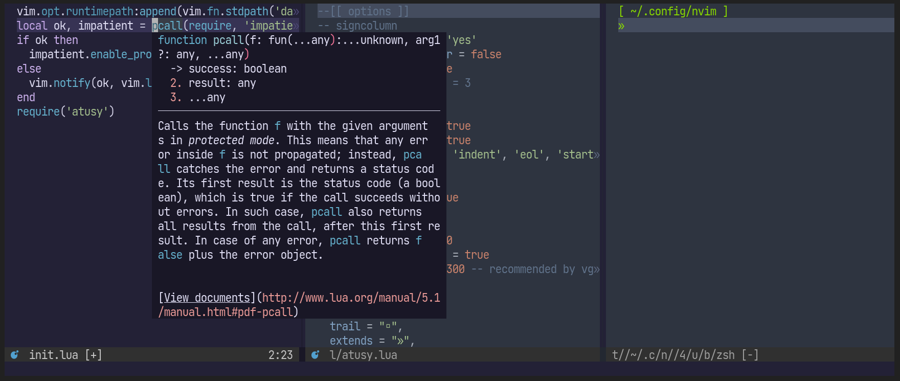

本記事は[Vimアドベントカレンダー2022 その3](https://qiita.com/advent-calendar/2022/vim)の17日目の記事です。

以前、Neovimと[styler.nvim]を使ってアクティブウィンドウを目立たせる方法を紹介しました。

> [styler.nvimでアクティブなウィンドウか否かでカラースキームを変える](https://blog.atusy.net/2022/11/25/styler-nvim-dim-inactive-windows/)

下図のように、注目しているウィンドウが一目瞭然なので気に入ってます。



しかし、当時のコードはいくつかの課題を抱えていたので、もう少し洗練させることにしました。

以下に、minimalな設定と、改善点の要約を置いておきます。

なお、筆者はWindowがアクティブか否かに加え、バッファがカレントディレクトリにあるかや、初期のtabpageにいるかといった条件で、より詳細にカラースキームを調整しています（[参考](https://github.com/atusy/dotfiles/blob/7e4c1348ebc0eaf648f3fd4029463a94ee89d46d/dot_config/nvim/lua/config/colorscheme.lua#L1)）。

``` lua
--[[
必要なプラグイン

- https://github.com/EdenEast/nightfox.nvim
- https://github.com/folke/styler.nvim
]]

-- 設定
-- styler.set_themeに与えるカラースキームはLua製な必要あり
DEFAULT_COLORSCHEME = 'duskfox'
INACTIVE_COLORSCHEME = 'nordfox'

-- カラースキームの適用
vim.cmd("colorscheme " .. DEFAULT_COLORSCHEME)

-- 非アクティブウィンドウ向けの関数
local function inactivate(win)
  -- skip for certain situations
  if not api.nvim_win_is_valid(win) then return end
  if api.nvim_win_get_config(win).relative ~= "" then return end

  -- apply colorscheme if not yet
  if (vim.w[win].theme or {}).colorscheme ~= INACTIVE_COLORSCHEME then
    require('styler').set_theme(win, { colorscheme = INACTIVE_COLORSCHEME })
  end
end

-- autocmdの発行
api.nvim_create_autocmd(
  { 'WinLeave', 'WinNew' },
  {
    group = vim.api.nvim_create_augroup('styler-nvim-custom', {}),
    callback = function(_)
      local win_event = vim.api.nvim_get_current_win()
      vim.schedule(function()
        local win_pre = vim.fn.win_getid(vim.fn.winnr('#'))
        local win_cursor = vim.api.nvim_get_current_win()

        -- カーソル位置のウィンドウでstyler.nvimを無効化する
        if (vim.w[win_cursor].theme or {}).colorscheme then
          require('styler').clear(win_cursor)
        end

        -- 直前のウィンドウにカーソルがなければinactivate
        if win_pre ~= 0 and win_pre ~= win_cursor then
          inactivate(win_pre)
        end

        -- イベントを発行したウィンドウにカーソルがなければinactivate
        if win_event ~= win_cursor then
          inactivate(win_event)
        end
      end)
    end
  }
)
```

- 予想外な挙動の抑制
    - 非同期がウリなプラグイン（Fern）でアクティブなウィンドウが変わっても直前のウィンドウが目立つままになるケースがあったので、callbackを`vim.schedule()`を使い、カラースキームの変更をmain event-loopに遅延
    - `WinEnter`を発行せずにカレントウィンドウが変わるケースを観測したので、`WinLeave`をトリガーに変更
        - 実際のカラースキーム変更は`vim.schedule()`で遅延しているので実質`WinEnter`より後になる
    - ウィンドウを変更せずに追加するケースに対応するため、`WinNew`をトリガーに追加
        - 例：`vim.api.nvim_win_call(0, vim.cmd.vsplit)`
    - 操作対象のウィンドウがいつの間にか消えている可能性に備え、`vim.api.nvim_win_is_valid()`でバリデーション
- パフォーマンス改善
    - 表示されているウィンドウすべてを走査していたので、適用対象を以下に限定
        - イベントを発行した時のウィンドウ
        - main event-loopにおけるアクティブウィンドウ
        - main event-loopにおける直前のウィンドウ
    - [styler.nvim]の適用の要否を判定
        - [styler.nvim]は状態をウィンドウローカルな`theme`変数に保存するので、そこをチェック

**ENJOY!!**

[styler.nvim]: https://github.com/folke/styler.nvim
