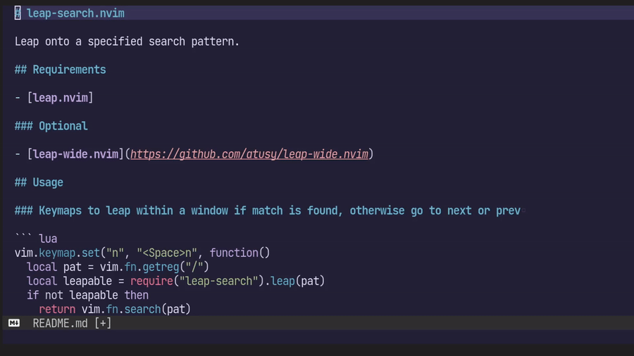

[leap.nvim]: https://github.com/ggandor/leap.nvim
[leap-search.nvim]: https://github.com/atusy/leap-search.nvim
[hop.nvim]: https://github.com/phaazon/hop.nvim
[easymotion]: https://github.com/easymotion/vim-easymotion

本記事は[Vim駅伝](https://vim-jp.org/ekiden/)の5/24の記事です。

# leap.nvimについて

[easymotion][]系のNeovimプラグインとしてメジャーどころには[hop.nvim][]や[leap.nvim][]があります。

[leap.nvim][]はいわゆる[easymotion][]系のプラグインで、入力した文字にマッチする箇所にラベル（a, b, c, ...）をつけ、ラベルを入力するとその位置にカーソルを移動します。

デフォルトの挙動は[easymotion][]の[2-character search motion](https://github.com/easymotion/vim-easymotion#2-character-search-motion)に近いもので、2文字にマッチする箇所にラベルをつけます。

2-character search motionとして見た時の[easymotion][]と[leap.nvim]の大きな違いは2つ。

- ラベルをつけるタイミング
    - [easymotion][]は2文字入力し終えてから
    - [leap.nvim][]は1文字目の段階から。ジャンプ先の最初の2文字目くらいは読まずとも頭に入っているだろうから、2文字目を入力する時間でラベルを読み、3文字目としてラベルを入力すれば思考のスピードでジャンプできる、という考え方のよう。
- ラベルをつける位置
    - [easymotion][]はジャンプするまさしくその位置
    - [leap.nvim][]はジャンプ先の2文字後。

      ```
      leap
      ^に飛びたい場合、「le」と左から文字を読みながら入力すると、3文字目の「a」の位置にラベルがつくので、そのまま目の移動に合わせてラベルを入力できる
      ```

合う合わないはありそうですが、個人的にはなかなか合理的に思います。

ところで[leap.nvim]は単純なモーションプラグインではなく、指定した箇所にラベルをつけて、選んだラベルに対して任意のアクションを実行するためのフレームワークでもあります。

`targets`引数を指定すれば、1、2、3行目の1文字目にラベルをつけられますし、`action`引数を指定すれば、選択したラベルやターゲットに関する情報を元に任意の操作を実行できます。

``` lua
require("leap").leap({
  targets = {
    { pos = {1, 1} },
    { pos = {2, 1} },
    { pos = {3, 1} },
  },
  action = function(x) {
    vim.print(x.label) -- 選択したラベルの表示
    vim.print(x.pos) -- 選択したターゲットの位置
  }
})
```

簡単に拡張できそうな気配がしますね！

# leap-search.nvimについて

というわけで指定したパターンを元に、Window内の文字列を検索してラベルをつけ、ジャンプする[leap-search.nvim][]を作ってみました。

## 正規表現による検索結果へのジャンプ

たとえば以下のように `leap.{-}nvim` などと、Vimの正規表現を利用できます。

``` lua
require("leap-search").leap("leap.{-}nvim")
```

応用すると直前の検索パターンでハイライトされた箇所にジャンプなんてこともできますね。

``` vim
/leap.{-}nvim
:lua require("leap-search").leap(vim.fn.getreg("/"))
```


とても便利なので、私は以下のようにマッピングしています。

``` lua
vim.keymap.set("n", "gn", function() require("leap-search").leap(vim.fn.getreg("/")) end)
vim.keymap.set("n", "gN", function() require("leap-search").leap(vim.fn.getreg("/"), {}, { backward = true }) end)
```

ドキュメントがまだ皆無ですが、第二引数が[leap-search.nvim][]独自のオプションのテーブル、第三引数が[leap.nvim][]本体のオプションのテーブルになってます。

## 様々な検索エンジンの利用

第二引数を弄ると、以下の検索エンジンの組み合わせも可能です。

- Vimの正規表現を用いる`vim.regex`
- Lua expressionまたは部分一致を用いる`string.find`
- migemoで日本語をローマジ検索する`kensaku.query`
    - エンジンが依存する[kensaku.vim](https://github.com/lambdalisue/kensaku.vim)が必要
    - 全角文字へのラベルに関するバグを補正する[leap-wide.nvim](https://github.com/atusy/leap-wide.nvim)を推奨

たとえば `string.find` で部分一致を、 `kensaku.query` でローマ時検索を実行するなら以下。

``` lua
-- 「kensaku」というパターンで「kensaku」にも「検索」にもラベルをつけられる
require("leap-search").leap("kensaku", {
  engines = {
    { name = "string.find", plain = true },
    { name = "kensaku.query" },
  },
})
```

## 対話的な検索

更に、第一引数に検索パターンに`nil`を与えると対話的な検索モードに入ります。
あいまい検索機能こそありませんが、[fuzzy-motion.vim](https://github.com/yuki-yano/fuzzy-motion.vim)に近い挙動です。

``` lua
require("leap-search").leap(
  nil,
  {
    engines = {
      { name = "string.find", plain = true },
      { name = "kensaku.query" },
    }
  },
  {
    -- 現在のWindow全体を検索対象にする
    target_windows = { vim.api.nvim_get_current_win() },
  },
)
```



**ENJOY!!**
