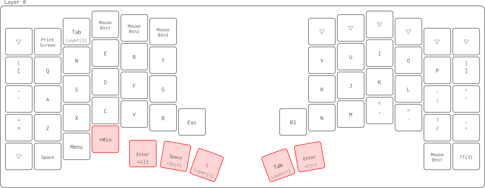
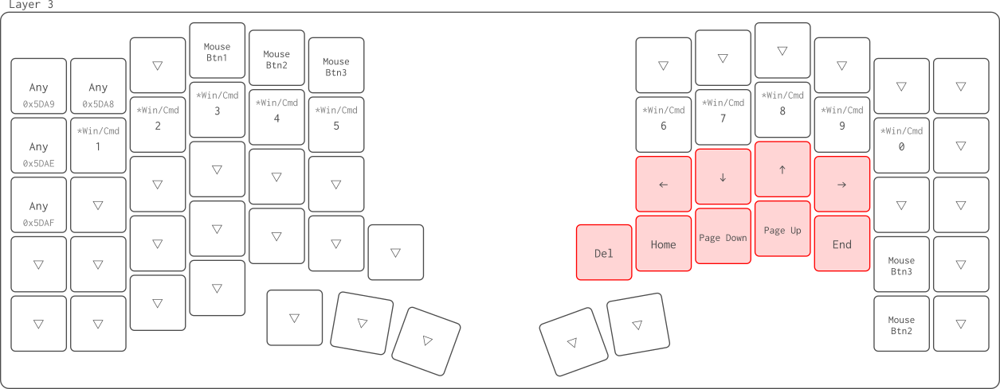
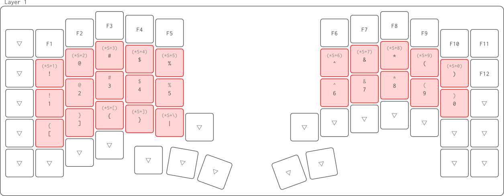
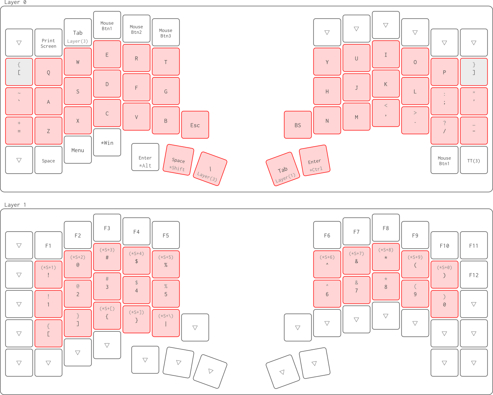
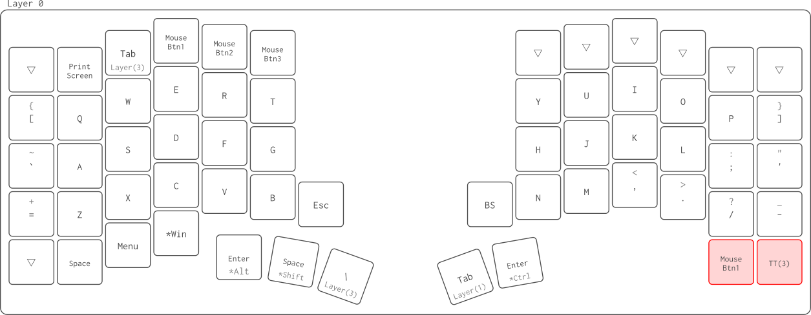
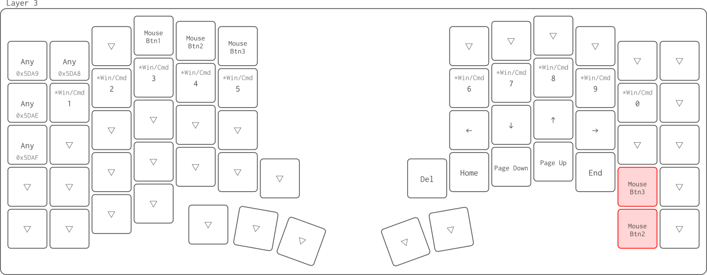
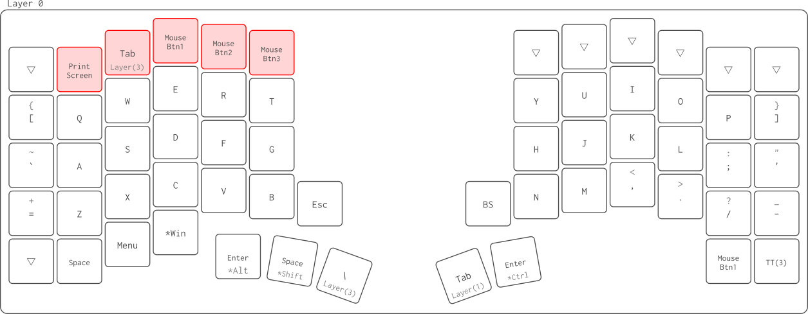

たぶんKeyball61ユーザーの中でも珍しい配列をしているだろうと思うので、その背景も含めてまとめておく。

右手トラックボールです。

# 親指によるHold & Tap

親指は`Ctrl`, `Shift`, `Alt`, `Win`や`Layer`操作などの修飾キーの操作を担います。

小指の負担が軽いだけでなく、他のアルファベットキーの位置に合わせて右手を使うか左手を使うか考える必要がないのも魅力です。

また、長押し（Hold）なら修飾キー、単押し（Tap）なら文字入力にしています。

両端のキーマップが独特ですが、これは左右の対称性を意識しています。

    [ Q ... P ]
    ` A ... ; '
    = Z ... / -

## Hold時に打ち辛いキーへの配慮

左端に`Alt`と`Enter`、右端に`Ctrl`と`Enter`がいますが、`Enter`は基本的に右側を入力します。
左側の`Enter`は`Ctrl+Enter`を入力したくなった時のための逃げ場です。

同様に`Space`の逃げ場も最下段の左の方に用意してあります。

また、`Shift`と`\`が左親指にいるために`|`が打ちにくくなっています。

これは右親指で`Layer(1)`を有効にした状態で`B`を押すと`|`（Bar）を入力できるようにして解決しています。

欲を言えば`Alt`を`|`と兼務させたい......。

## 親指の激務への配慮

親指以外は、隣合うキーを打ちたい場合に、隣合う指を利用できます。
たとえば普通は`F`を人差し指で入力しますが、`GF`と入力したい場合は`G`を人差し指、`F`を中指で入力した方が楽でしょう。

一方で親指は他の指の協力を期待できず、特にHold系を連続的に打ち分ける状況は相当に辛いです。

そこで、まずHold系の基本となる`Shift`と`Ctrl`を左手と右手に分配しました。

私は日本語入力メソッドにSKKを使っているので、`Shift`を相当に頻用します。
このため、文字入力に際して左親指は`Shift`と`Space`の入力で限界に感じました。
そこで、左手によるLayer移動は連続的な文字入力の妨げとならないキーを集めたLayer3としています。
Layer3で文章の編集（文字の入力ではなく！）に係るキーは、矢印や`Home`などの移動系と、`Del`のみです。
ちなみにこれらのキーが右手に集中しているのは、左`Win`キーとの組み合わせを念頭に置いてます。

一方で右親指が担当している`Ctrl`キーは文字入力中は比較的暇なので、Layer移動時は文字入力に関係するLayer1としています。
Layer1には数字や記号が集中しています。

# 文字入力時のホームポジションの堅守

ほとんどの文字をホームポジション中心の3段に収まるように配置しています。

一部のキーはレイヤー操作が必要になりますが、`Shift`との同時押しは不要としています。

たとえばLayer1はホームポジションに数字キーがいますが、その上段に`Shift+数字`で入力できる`!@#$%`などの記号を配置しています。
本来最上段に存在する数字キーを下段に平行移動させただけという覚えやすさも特徴です。

あと、これは私の個人的な都合でしょうが、Layer0の`Q`と`P`の外側に配置した`[`と`]`を入力しようとすると手首を捻る必要があります。
これでホームポジションから大きくずれるのを嫌い、Layer1の`ZXCV`に`[]{}`を割り当てています。

蛇足ですが、Layer1の最上段にはFunctionキーを置いてます。

# マウス操作のしやすさ

なんやかんやマウス操作をする場面は多いので、快適さを追求しています。

## 片手版

Layer0の左下に`Mouse Btn1`と`TT(3)`を配置することで、片手操作を実現。

`TT(3)`を押してLayer3に移動すると`Mouse Btn1`が`Mouse Btn2`に変わり、`/`が`Mouse Btn3`に変わります。

またKeyball61のデフォルト設定でLayer3ではトラックボールがスクロール操作を担います。

簡単なマウス操作ならこれで十分。

## 両手版

もっとがっつり操作したい時用。

Layer0の左手最上段に便利そうなキーを集めています。

`Tab`や`PrintScreen`といったマウス操作とは直接関係せずともGUI操作に便利なキーがいるのも特徴です。

実はつい昨日まで、左手の最下段左端には`Ctrl`がいました。
ここは左小指の付け根で押しながらLayer3を有効にすると、トラックボールによる画面の拡縮がしやすくなるので復活させる予定。

# 今後

# Layer0の最上段どうする......？

まったく使ってないのはもったいない気が......。

# Layer2どうする......？

使ってない......。マクロパッド化するとか......？アイデア募集。

# 左手トラックボールにするならどうする......？

Atusyは右利きです。
トラックボール操作を左手にすると、筆記とPC操作を同時にできるのが魅力らしいです。

おそらく、基本的には親指のLayer3とLayer1を入れ替えるのかなと思います。

一部のキーが打ちにくくなるので、そこは対策が必要か。

-   `Del`はLayer3からLayer1に移動
-   `Ctrl+矢印`しにくくなる。これはもっぱらVimのWindowサイズの変更に使ってるものなので、Vim側を`Shift+矢印`にマッピングしなおすかも。

案外いけるのか......？

とはいえ、昨今、筆記具を持つ場面がほとんどないので、必要性は不明......。
