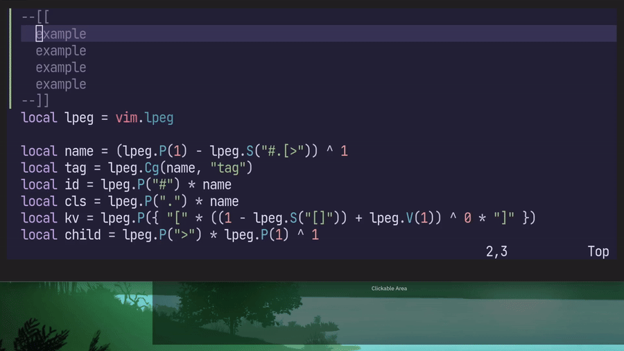

[mini.surround]は[vim-sandwich]のような、括弧やクオーテーションなどで囲まれた文字列を編集するためのNeovim向けプラグインです。

選択範囲を`()`で囲う、文字列の囲いを`()`から`""`に変更する、`""`による囲いを削除するといったことが可能です。
同様にHTMLタグに対する操作にも対応していますが素朴なものです。

emmet記法に対応すると、`div.foo`で`<div class=foo></div>`に相当するタグの追加や削除などができて便利そうなので実装してみました。
他にも`div>p`で`<div><p></p></div>`のようなネストしたタグも扱えるのでなかなか便利です。
現在はとりあえずタグの追加と置換時の新しいタグでemmet記法を使えます。



設定方法は記事後半の[実装](#impl)または[私の設定](https://github.com/atusy/dotfiles/blob/76fdab24798868a73489156c00e5fda08ba54589/dot_config/nvim/lua/plugins/textobj.lua#L147-L168)を参考にしてください。

実装方法ですが、emmet記法をどうパースするかが課題ですね。
たぶん、文字列操作でもそこまで大変にはなりません。
でもせっかくならもっとそれっぽいパーサーが欲しいですね。

Neovimユーザーであれば、パーサーと聞くと`treesitter`を思い浮かべます。
残念ながら`treesitter`で書かれたemmetパーサーはなさそうです。
かと言って[mini.surround]の用途で`treesitter`のパーサーをがっつり書こうという気にもなれません。

実はNeovimは[lpeg]というパターンマッチングライブラリを内蔵しており、これを使ってパーサーを実装できます。

実際以下の84行程度のファイルで実装しています。
実体としてはパーサーは47行で実装しており、残りはパースした結果をHTMLタグに変換するコードです。

https://github.com/atusy/dotfiles/blob/5919dfb49ea21ee70cd3fcb26fa48819c412426e/dot_config/nvim/lua/atusy/parser/emmet.lua#L1-L84

というわけで、`mini.surround`をemmet対応させられて便利！という話でもありつつ、Neovimのマイナー（？）機能な`lpeg`の紹介でした。

ENJOY!

## 実装 {#impl}

[私の設定](https://github.com/atusy/dotfiles/blob/76fdab24798868a73489156c00e5fda08ba54589/dot_config/nvim/lua/plugins/textobj.lua#L147-L168)から必要な部分を抜き出したものです。たぶん動くはず。

``` lua
-- emmet parserの実装
local lpeg = vim.lpeg
local name = (lpeg.P(1) - lpeg.S("#.[>")) ^ 1
local tag = lpeg.Cg(name, "tag")
local id = lpeg.P("#") * name
local cls = lpeg.P(".") * name
local kv = lpeg.P({ "[" * ((1 - lpeg.S("[]")) + lpeg.V(1)) ^ 0 * "]" })
local child = lpeg.P(">") * lpeg.P(1) ^ 1
local attr = lpeg.C(child + kv + id + cls) ^ 0

local kindmap = {
  ["."] = "class",
  ["#"] = "id",
  ["["] = "kv",
  [">"] = "child",
}

local function parse(s)
  local splits = lpeg.match(lpeg.Ct(tag * attr), s)

  if type(splits) ~= "table" then
    return
  end

  local res = {
    tag = splits.tag,
    class = {},
    id = {},
    kv = {},
    child = nil,
  }

  for _, sp in ipairs(splits) do
    local k, v = string.match(sp, "(.)(.*)")
    local kind = kindmap[k]
    if kind == "child" then
      res.child = parse(v)
    else
      if kind == "kv" then
        v = string.gsub(v, "%]$", "")
      end
      table.insert(res[kind], v)
    end
  end

  return res
end

-- emmet -> HTMLタグの変換の実装
local function opentag(x)
  local res = "<" .. x.tag
  if #x.id > 0 then
    res = res .. ' id="' .. x.id[1] .. '"'
  end
  if #x.class > 0 then
    res = res .. ' class="' .. table.concat(x.class, " ") .. '"'
  end
  if #x.kv > 0 then
    res = res .. " " .. table.concat(x.kv, " ")
  end
  res = res .. ">"
  if x.child then
    res = res .. opentag(x.child)
  end
  return res
end

local function closetag(x)
  local res = ""
  if x.child then
    res = closetag(x.child) .. res
  end
  res = res .. "</" .. x.tag .. ">"
  return res
end

local function totag(x)
  local p = parse(x)
  return { left = opentag(p), right = closetag(p) }
end


-- mini.surroundの設定
require("mini.surround").setup({
  n_lines = 100,
  custom_surroundings = {
    t = {
      input = { "<(%w-)%f[^<%w][^<>]->.-</%1>", "^<.->().*()</[^/]->$" }, -- from https://github.com/echasnovski/mini.surround/blob/14f418209ecf52d1a8de9d091eb6bd63c31a4e01/lua/mini/surround.lua#LL1048C13-L1048C72
      output = function()
        local emmet = require("mini.surround").user_input("Emmet")
        if not emmet then
          return nil
        end
        return totag(emmet)
      end,
    }
  },
})
```

[vim-sandwich]: https://github.com/machakann/vim-sandwich
[mini.surround]: https://github.com/echasnovski/mini.surround
[lpeg]: https://www.inf.puc-rio.br/~roberto/lpeg/
