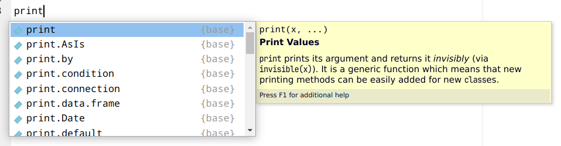
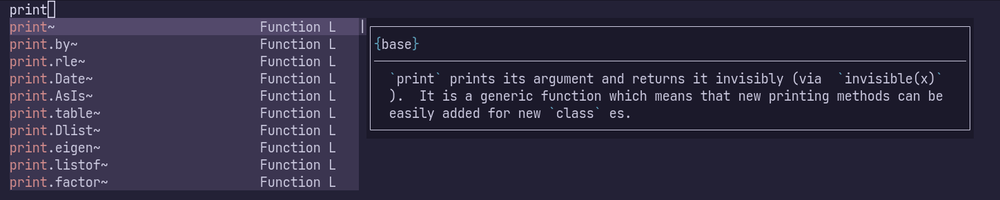

[R言語 Advent Calendar 2023](https://qiita.com/advent-calendar/2023/rlang)の19日目の記事です。
昨日の記事はwawana21さんによる「[ggplot2で標準偏差付きの折れ線グラフを描く](https://qiita.com/wawana12/items/2e9ed1eb64ab27682a3c)」でした。可視化大事。

2023年、ずいぶんとRを触ることが減りました。
それでも[ftExtra](https://ftextra.atusy.net)などのパッケージの更新をほそぼそとやってます。

それもこれも[Osaka.R](https://osaka-r.connpass.com)で朝もくしているおかげ......。
この記事も朝もくの時間で書いてます。
ほんとはオフラインなイベントも開催したいけれどなかなか時間をとれてません。

最近はRStudioを触ることもめっきり少なくなり、開発環境はもっぱらNeovimです。
この記事もNeovimで書いています。

RStudioにはコード補完や関数定義の表示など、いかにもIDEな便利機能がいっぱいです。
Rを始めるならRStduioから......というのはたぶん今も変わらないでしょう。



しかし、VSCodeやNeovimといったエディタでもこれらの便利機能を享受できます。
Neovimでの補完だってこのとおり。
ちゃんとヘルプもついてきます。



それもこれも**[languageserver](https://github.com/REditorSupport/languageserver)**パッケージのおかげです。
**[languageserver](https://github.com/REditorSupport/languageserver)**パッケージは[Language Sever Protocol](https://microsoft.github.io/language-server-protocol/)という仕様に基いて、変数定義やヘルプなどの情報の問い合わせに対応してくれるサーバーを実装しています。

しかしちょっとした不満が......。

たとえば`rmarkdown::render`関数の定義を要求した時、**[languageserver](https://github.com/REditorSupport/languageserver)**パッケージは関数定義を一時ファイルに書き出します。
これでは、`rmarkdown::render`関数の中で利用されている`pandoc_available`関数の定義を見たいと思っても、一時ファイルと`pandoc_available`関数が定義されているファイルの関連付けがないために、遡れません。

また、他の言語におけるLanguage Serverは、同じ変数を複数回定義している場合に、定義箇所のリストを返します。
しかし、Rの**[languageserver](https://github.com/REditorSupport/languageserver)**パッケージは1つしか見つけてくれません。

というわけでなんとかしたいなと考えています。

たぶん、ソースコードのパース結果から代入の発生箇所を探せばよかろうと考えています。

Rはbaseパッケージに`parse`関数を持っており、`getParseData`関数を組み合わせることで、ソースコードのパース結果をトークン（変数名とか）の位置情報つきのデータフレーム化してくれるようです。

``` r
src = "
x <- 1

x + 1 -> x

print(x)
"

getParseData(parse(text = src, keep.source = TRUE))
```

       line1 col1 line2 col2 id parent                token terminal  text
    9      2    1     2    6  9      0                 expr    FALSE      
    3      2    1     2    1  3      5               SYMBOL     TRUE     x
    5      2    1     2    1  5      9                 expr    FALSE      
    4      2    3     2    4  4      9          LEFT_ASSIGN     TRUE    <-
    6      2    6     2    6  6      7            NUM_CONST     TRUE     1
    7      2    6     2    6  7      9                 expr    FALSE      
    24     4    1     4   10 24      0                 expr    FALSE      
    20     4    1     4    5 20     24                 expr    FALSE      
    14     4    1     4    1 14     16               SYMBOL     TRUE     x
    16     4    1     4    1 16     20                 expr    FALSE      
    15     4    3     4    3 15     20                  '+'     TRUE     +
    17     4    5     4    5 17     18            NUM_CONST     TRUE     1
    18     4    5     4    5 18     20                 expr    FALSE      
    19     4    7     4    8 19     24         RIGHT_ASSIGN     TRUE    ->
    21     4   10     4   10 21     23               SYMBOL     TRUE     x
    23     4   10     4   10 23     24                 expr    FALSE      
    38     6    1     6    8 38      0                 expr    FALSE      
    29     6    1     6    5 29     31 SYMBOL_FUNCTION_CALL     TRUE print
    31     6    1     6    5 31     38                 expr    FALSE      
    30     6    6     6    6 30     38                  '('     TRUE     (
    32     6    7     6    7 32     34               SYMBOL     TRUE     x
    34     6    7     6    7 34     38                 expr    FALSE      
    33     6    8     6    8 33     38                  ')'     TRUE     )

これを使えばtoken列の値が*LEFT_ASSIGN*か*RIGHT_ASSIGN*な場合に代入が発生していると分かりますね。

そして、上記の例であれば、*LEFT_ASSIGN*なtokenのparentは*9*なので、*LEFT_ASSIGN*より上の行に登場するparentが*9*な*expr*トークンを見つけてあげます。
で、*expr*トークンの子供が*SYMBOL*トークンのみから成る場合は変数への代入と判断できそうです。

Rの代入演算子は独特なので、以下のように*SYMBOL*以外の*expr*に代入するケースもある点には注意ですね。

``` r
src = "
x <- 1
attr(x, 'attr') <- 'value'
"

getParseData(parse(text = src, keep.source = TRUE))
```

       line1 col1 line2 col2 id parent                token terminal    text
    9      2    1     2    6  9      0                 expr    FALSE        
    3      2    1     2    1  3      5               SYMBOL     TRUE       x
    5      2    1     2    1  5      9                 expr    FALSE        
    4      2    3     2    4  4      9          LEFT_ASSIGN     TRUE      <-
    6      2    6     2    6  6      7            NUM_CONST     TRUE       1
    7      2    6     2    6  7      9                 expr    FALSE        
    32     3    1     3   26 32      0                 expr    FALSE        
    27     3    1     3   15 27     32                 expr    FALSE        
    12     3    1     3    4 12     14 SYMBOL_FUNCTION_CALL     TRUE    attr
    14     3    1     3    4 14     27                 expr    FALSE        
    13     3    5     3    5 13     27                  '('     TRUE       (
    15     3    6     3    6 15     17               SYMBOL     TRUE       x
    17     3    6     3    6 17     27                 expr    FALSE        
    16     3    7     3    7 16     27                  ','     TRUE       ,
    21     3    9     3   14 21     23            STR_CONST     TRUE  'attr'
    23     3    9     3   14 23     27                 expr    FALSE        
    22     3   15     3   15 22     27                  ')'     TRUE       )
    28     3   17     3   18 28     32          LEFT_ASSIGN     TRUE      <-
    29     3   20     3   26 29     31            STR_CONST     TRUE 'value'
    31     3   20     3   26 31     32                 expr    FALSE        

パースには多少の時間もかかるかもしれないので、色々工夫の余地はありそうですが、よりよい定義ジャンプの実装に一歩近付けそうな気配を感じました。

投稿後にMichael Chiricoさんが教えてくれましたが、`xmlparsedata::xml_parse_data()`が便利らしいです。
たしかによさそう。

> https://cran.r-project.org/web/packages/xmlparsedata/readme/README.html

**ENJOY**
