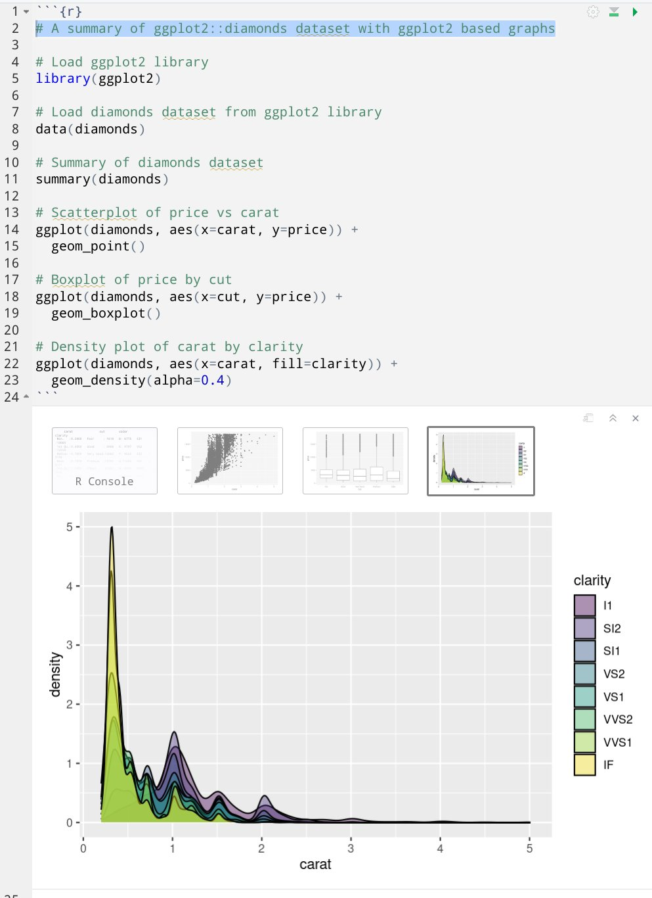
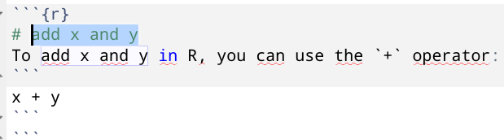
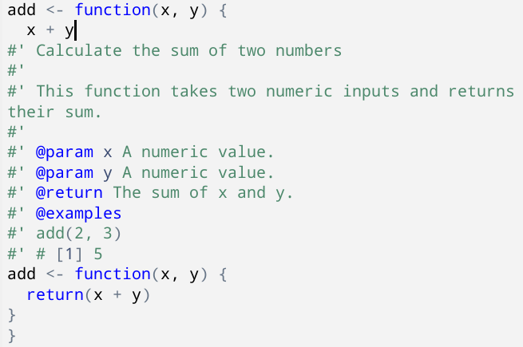

ChatGPTを使ってRStudio上でのコーディングを支援する[gptstudio]パッケージが登場しました。
姉妹製品に[gpttoools]パッケージもあります。

利用には[OpenAIのAPI Key](https://platform.openai.com/account/api-keys)が必要にです。
生成するトークンに対する従量課金制ですが、$5のお試し枠がついてます。

アドインを通じて様々な機能を提供しています。
開発者がデモ動画を後悔しているので、詳細はレポジトリを参照してもらうとよさそうです。
また、アドインの利用方法については[別記事](https://gihyo.jp/article/2022/10/increase-productivity-of-r-02?summary)を参照ください。

- [gptstudio]製アドイン
    - `ChatGPT`: RStudioのViewer上でChatGPTとChatできる
    - `ChatGPT in Source`: ソースファイル上で選択したコメントやコードから、ChatGPT製の実装を提案する。選択範囲は編集されず、選択範囲直下に提案内容が挿入される
    - `Comment your code`: ソースファイルに適宜コメントを追加する。選択範囲を直接編集する
    - `Spelling and Grammer`: ソースファイル上の綴りや文法の誤りを修正する。選択範囲を直接編集する
- [gpttools]製アドイン
    - `Add roxygen to function`
    - `ChatGPT with Retrieval` 
    - `Document Data`
    - `Convert script to function`
    - `Suggest Improvements`
    - `Suggest unit test`

[gpttools]パッケージのアドインについては説明を省略しましたが色々できそうですね。

たとえば、`ggplot2::diamonds`データセットを`ggplot2`パッケージを使って要約してくれと頼んだ結果が以下。
初めて使うパッケージの雰囲気を把握するケースではかなり威力を発揮しそうですね。

ChatGPT本体を利用した例としては、先日のTokyo.Rでkuroさんがtidymodelsパッケージを説明するためのコードを生成していましたね。

> tidymodelsでモデリング 事始め
> https://kuro1981.github.io/tokyorSlides/2023_TokyoR_for_begineer/2023_TokyoR_for_begineer.html#/title-slide

有用ながら、いくつか発展途上な感じも見受けられるので、今後に期待したいところ

- 選択範囲に対してアドインを実行した後、結果が反映されるまで無反応に見える
- 結果反映までにカーソル位置を変えるとコードの挿入位置が狂う
- 選択範囲に注意が必要で、カーソル位置が文脈を読み取るほどの機能はない
    - `ChatGPT in Source`を使い、コメントからコードを生成する場合、選択範囲にコメント記号（`#`）も含めておく必要あり
        - `#`を含めなかった場合、Markdownで記述されたRコードと説明が挿入されてしまった。結果的に、以下の例ではR Markdownのチャンク内にMarkdown文書を記述してしまった

          

    - `Add roxygen to function`を使い、関数にRoxygen2コメントによるドキュメントを追加する場合、関数全体を選択しておく必要あり
        - 関数内部にカーソルがあり、何も選択していない状態で、同機能を実行すると、カーソル行を元にRoxygen2コメントつきの関数が実装されてしまった。結果的に、以下の例では関数が入れ子になった

          

- GitHub Copilotのようなコードの補完機能はなさそう

## GitHub Copilotとの関係

AIによるコーディング支援といえばGitHub Copilotですが、VSCodeなど一部のエディタでしか使えない現状があります。

> Getting started with GitHub Copilot <https://docs.github.com/en/copilot/getting-started-with-github-copilot>

CopilotそのものはAPIを提供している様子がなく、基盤技術となっていてAPI提供のある[Codex](https://platform.openai.com/docs/models/gpt-3)はDeprecated（廃止予定）な模様。

OpenAIの[APIドキュメント](https://platform.openai.com/docs/models/overview)を読むに、GPT-4またはGPT-3.5がCodexを置き換えていきそうです。

[gptstudio]パッケージや[gpttools]パッケージはまさにGPT-3.5を利用しているパッケージなようですね。

価格面ではOpenAI APIは従量課金で、Copilotは月額制です（個人で\$10/月、企業で\$19/月）。

使い方次第ではCopilotが割高になりそうですが、エディタが公式サポートされていれば、便利な機能も豊富そうですし、生成したコードが原因で著作権侵害などの訴えを受けた場合の保険も提供してくれるようです。

> GitHub will defend you against any claim by an unaffiliated third-party that your use of GitHub Copilot misappropriated a trade secret or directly infringes a patent, copyright, trademark, or other intellectual property right of a third party, up to the greater of $500,000.00 USD or the total amount paid to GitHub for the use of GitHub Copilot during the 12 months preceding the claim. 
> https://github.com/customer-terms/github-copilot-product-specific-terms

[gptstudio]: https://github.com/JamesHWade/gptstudio/

[gpttools]: https://github.com/JamesHWade/gpttools/

