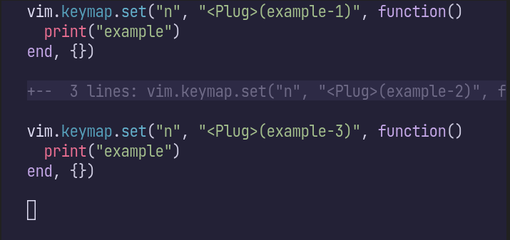
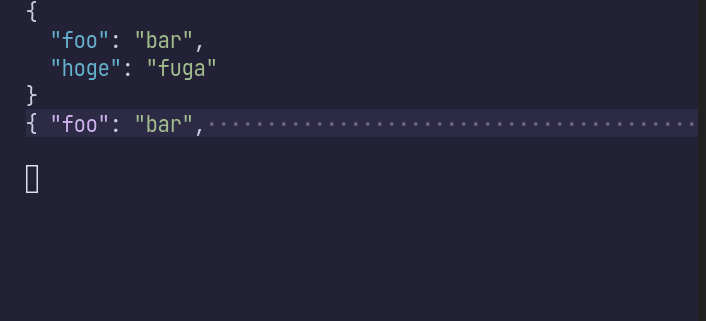

2023/10/27の[Vim駅伝](https://vim-jp.org/ekiden/)記事です。
前回はKyoh86さんによる「[忘れられないQuickfix](https://zenn.dev/vim_jp/articles/f23938c7df2dd9)」でした。

Neovimは[Tree-sitter](https://tree-sitter.github.io/tree-sitter/)を組込むことで、コードをパースし、文法に基づいたシンタックスハイライトや文字列選択を可能にしています。

最近、Neovimに`vim.treesitter.foldtext`関数が追加され、折り畳んだコードのハイライトが可能になりました[^pr-foldtext]。
Neovim 0.10で利用可能になる見込みです（2023/10/17時点の最新版は0.9.4）。

`set foldtext=v:lua.vim.treesitter.foldtext()`すると有効化でき、以下のように折り畳んだ部分が色付きます。ステキ！
関連するところで、`vim.treesitter.foldexpr()`を使うと折り畳み範囲の決定もTreesitter任せにできます。
これらの機能は独立しているので、折り畳み範囲は手動で決めつつ (`set foldmethod=manual`)、色付けはTreesitterに任せるのもアリです。


対するデフォルト（`set foldtext=foldtext()`）は以下の通り、色付いていません。
個人的には折り畳んだ頭の部分に付加情報の`+--  3 lines: `がつくのも苦手でした。



ちなみに、可読性の高いfoldtextを実現するプラグインには[readablefold.vim](https://github.com/lambdalisue/readablefold.vim)や[pretty-fold.nvim](https://github.com/anuvyklack/pretty-fold.nvim)、[nvim-ufo](https://github.com/kevinhwang91/nvim-ufo)などがあります。
[nvim-ufo](https://github.com/kevinhwang91/nvim-ufo)はTreesitterによる色付けにも対応しているようです。

もひとつちなんでおくとこの機能の実現の立役者は、foldtextのhighlightをvirtual textの書式で定義できるようになった下記のPRです。

> feat(folds): support virtual text format for 'foldtext' https://github.com/neovim/neovim/pull/25209

さて、これだけだとただの使ってみた系の記事なのですが、少し工夫してあげると、JSONの折り畳みなんかもキレイに表示できるようになります。
通常、オブジェクトを折り畳んでしまうと`{・・・・・・・・・・・・・・・`みたいな表示になってしまって中身に皆目検討つかなくなります。
`vim.treesitter.foldtext`関数をうまく使ってあげると、2行目の内容も色付けた上で1行目にマージしたfoldtextを生成できます。



```lua
function Foldtext()
  local res = vim.treesitter.foldtext()

  if type(res) == "string" then
    return res
  end

  if (#res == 1 and res[1][1] == "{") or (#res == 2 and res[1][1]:match("^%s+$") and res[2][1] == "{") then
    local foldstart = vim.v.foldstart
    vim.v.foldstart = foldstart + 1
    local text = vim.treesitter.foldtext()
    if type(text) == "table" then
      for i, v in pairs(text) do
        if i == 1 and v[1]:match("^%s+$") then
          v[1] = " "
        end
        table.insert(res, v)
      end
    end
    vim.v.foldstart = foldstart
  end
  return res
end

vim.opt.foldtext = [[v:lua.Foldtext()]]
```


[Vim駅伝](https://vim-jp.org/ekiden/)、次回は10/30でmityuさんによる「:terminal から親の Vim でファイルを開く(cmd.exe 編)」です。

ENJOY!

[^pr-foldtext]: feat(treesitter): add foldtext with treesitter highlighting https://github.com/neovim/neovim/pull/25391
