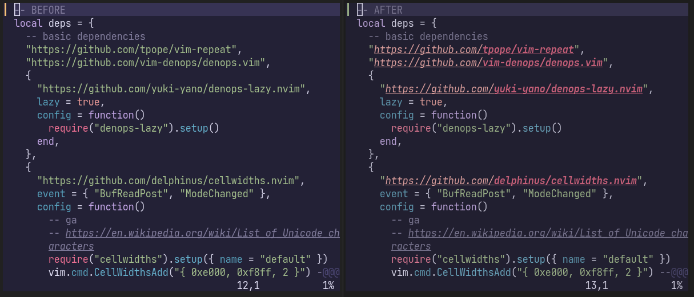

この記事は[Vim駅伝](https://vim-jp.org/ekiden/)2023年11月17日(金)の記事です。

VimやNeovimでプラグインマネージャーに使いたいプラグインを指定するとき、GitHubでの配布物であれば`ユーザー名/レポジトリ名`での指定が一般的です。

一週間前のVim駅伝記事にあたる「[Neovimのプラグインってどうやっていれるの？](https://zenn.dev/vim_jp/articles/20231113vim_ekiden)」でも、以下の通り`ユーザー名/レポジトリ名`の書式を用いていました。

``` lua
-- lua/plugins/nvim-tree.lua
return {
  "nvim-tree/nvim-tree.lua"
}
```

しかしこの方法には2つ欠点があります。

-   プラグインを追加する時、URLの一部を切り取る手間がある
-   レポジトリにアクセスする時、完全なURLを復元する必要がある

もちろん、これらをプラグインの力で解決する手もあるでしょうが、個人的にはURLの<https://github.com/nvim-tree/nvim-tree.lua>を指定する方が好みです。

一方で完全なURLを指定すると、プラグインをたくさん記述した場合に、プラグイン名の部分を目で追いづらくなります。

そこで、Neovimのシンタックスハイライトをカスタマイズして、プラグイン名を分かりやすく表示してみました。
左がシンタックスハイライト適用前、右が適用後です。



## 設定方法

Neovimはtree-sitterというパーサージェネレータを利用したシンタックスハイライトを備えます。

これを活用するため、まずはURIのパーサーを書く......のは先駆者だけで、パーサーは私の用意したものを使えますので、Neovimの設定方法を紹介します。

<http://github.com/atusy/tree-sitter-uri>

ちなみに、そこそこ頑張ったので割と広範囲のURIをパースできます。
少なくともWikipediaに記載の[例](https://en.wikipedia.org/wiki/Uniform_Resource_Identifier#Example_URIs)や`file:///home/atusy`に対応しています。

実際にMarkdown中に`uri`言語のコードブロックを用意した例が以下。
ハイライトを定義してやればとってもカラフルにできます（いらない）。


### nvim-treesitterの設定

Neovimはtree-sitterによるシンタックスハイライトの機能を組み込んでいますが、それを簡単に使えるように[nvim-treesitter](https://github.com/nvim-treesitter/nvim-treesitter)プラグインを導入します。

お好みのプラグインマネージャーを使ってインストールしてください。

プラグインのREADMEにも記載されている通り、このプラグインを通じて任意のパーサーを手軽に追加できます（[Adding parsers](https://github.com/nvim-treesitter/nvim-treesitter#adding-parsers)）。

実際の設定方法は以下の通り。

``` lua
-- パーサーのインストール先（任意）
local treesitterpath = vim.fn.stdpath() .. "/treesitter"
vim.opt.runtimepath:append(treesitterpath)

-- URIパーサーの設定追加
local parser_config = require("nvim-treesitter.parsers").get_parser_configs()
parser_config.uri = {
  install_info = {
    url = "https://github.com/atusy/tree-sitter-uri",
    files = { "src/parser.c" },
    generate_requires_npm = false, -- if stand-alone parser without npm dependencies
    requires_generate_from_grammar = false, -- if folder contains pre-generated src/parser.c
  },
  filetype = "uri", -- if filetype does not match the parser name
}

-- nvim-treesitterプラグインの設定
-- URIパーサーのインストールもここで行われる
require("nvim-treesitter.configs").setup({
  parser_install_dir = treesitterpath,
  ensure_installed = "all",
})
```

atusy自身の設定は以下にあります。

<https://github.com/atusy/dotfiles/blob/33823c7fe8c0f820670a14eeab8844ab3dba68a7/dot_config/nvim/lua/plugins.lua?plain=1#L487-L520>

### Injectionの設定

tree-sitterは、パースした内容の一部に異なるパーサーを適用できます。
この性質を利用して、Lua言語の文字列がURLっぽい時だけURIパーサーを適用してみましょう。

以下の内容を `~/.config/nvim/after/queries/lua/injections.scm` に書き込めばOKです。

``` lua
;; extends
(
  string
  (string_content) @injection.content
  (#vim-match? @injection.content "^[a-zA-Z][a-zA-Z0-9]*:\/\/\\S\+$")
  (#set! injection.language "uri")
)
```

InjectionするとURLをパースできるようになるので、`vim.treesitter.inspect_tree()`を使ってパース結果を確認できます。

たとえば <https://github.com/atusy/tree-sitter-uri> という文字列に対しては

``` scm
(uri) ; [0:1 - 40]
 (scheme) ; [0:1 - 5]
 (authority) ; [0:7 - 18]
  (host) ; [0:9 - 18]
 (path) ; [0:19 - 40]
```

と表示されます。

### Highlightの設定

Injectionしただけではシンタックスハイライトが効きません。

適用すべきハイライトの指定が必要です。

素朴には、以下の内容を `~/.config/nvim/after/queries/uri/highlight.scm` に書き込めばOKです。

``` scm
( ( uri ) @text.uri )
( ( path ) @text.strong )
```

[nightfox](https://github.com/EdenEast/nightfox.nvim)などのカラースキームは`@text.uri`や`@text.strong`に対するハイライトを定義しているので、URLな文字列を含むLuaファイルを開き直せばURL部分がハイライトされるようになります。

定義がない場合は`:hi`コマンドあたりを使って調整してください。

なお、<https://github.com/atusy/tree-sitter-uri>のようなURLにおいて、`path`とは`/atusy/tree-sitter-uri`の部分で、スラッシュ始まりになります。
従って、先のシンタックスハイライト定義では、`path`先頭の`/`も`@text.strong`でハイライトしてしまいます。

先頭の`/`を除外してハイライトしたい場合は`#offset!`ディレクティブを用いてハイライトの適用範囲を調整してください。

``` scm
( ( uri ) @text.uri )
( ( path ) @text.strong (#offset! @text.strong 0 1 0 0))
```

## ENJOY!

これであなたも心置きなく、プラグインの指定をURLで行えますね！

ちなみにtree-sitterはシンタックスハイライトだけでなく、concealという機能にも応用でき、`https://github.com/`の部分を隠したり絵文字やNerdFontなどで置き換えることもできる......はずです。

今回はそこまでのモチベーションがありませんでしが、是非挑戦して結果を駅伝に書いてくれる人がいると嬉しいです！
