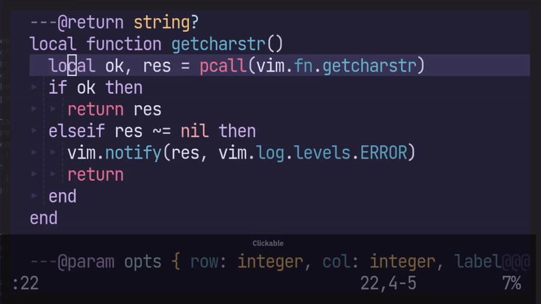
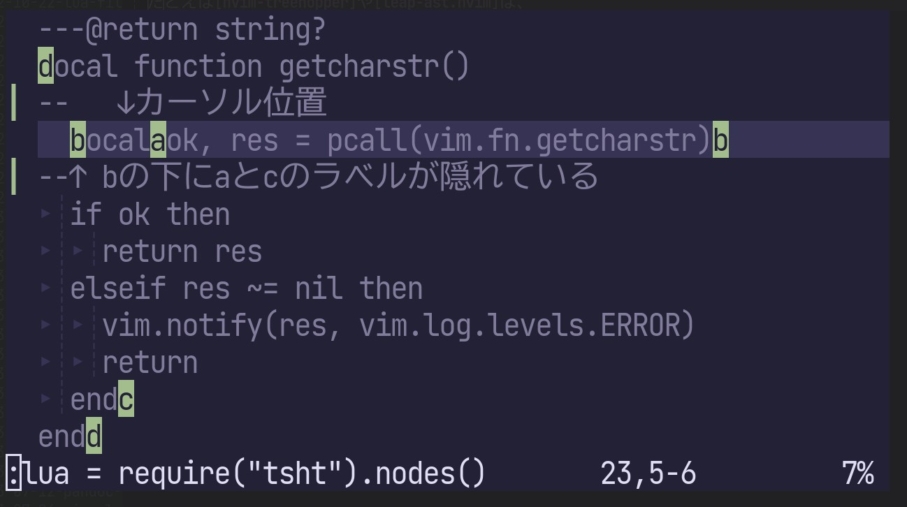
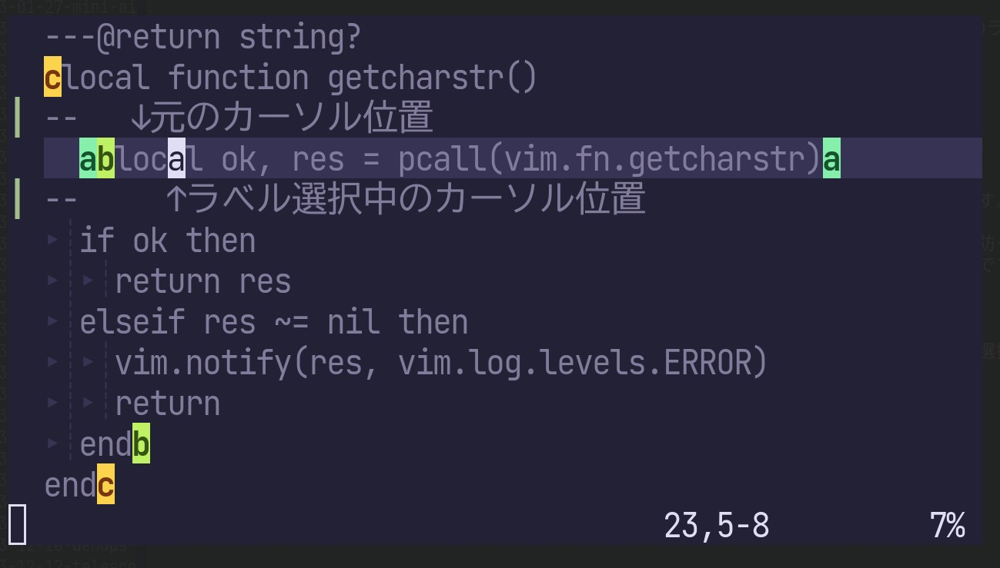
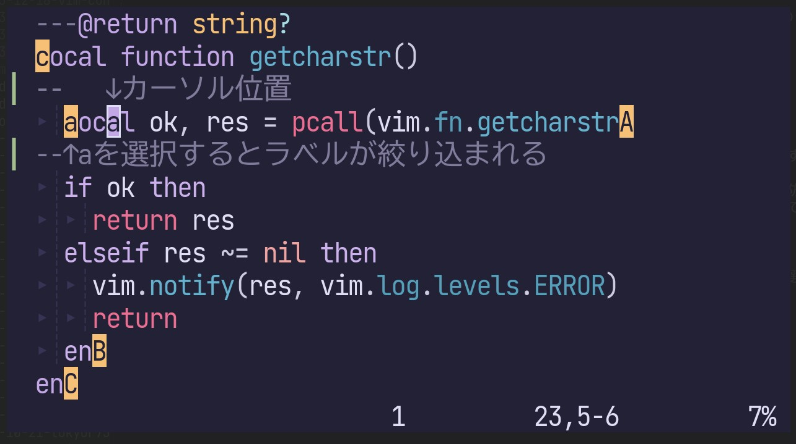
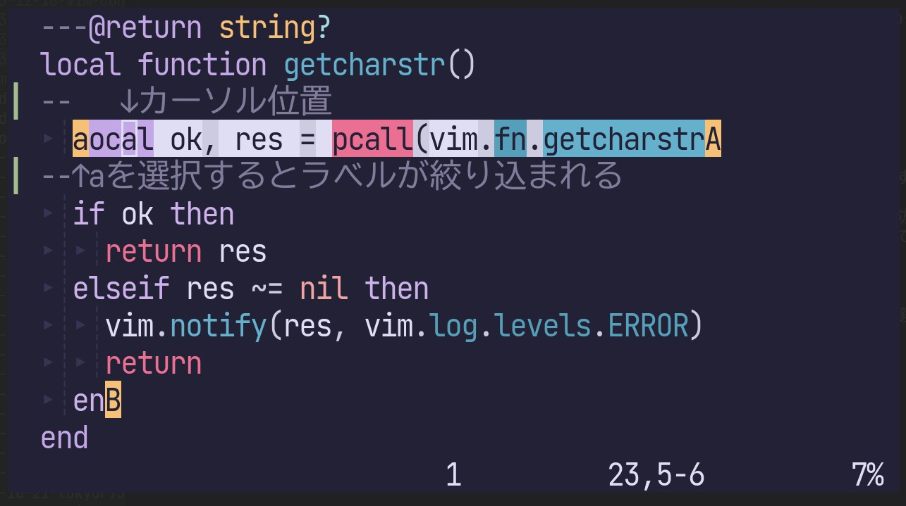

[treemonkey.nvim](https://github.com/atusy/treemonkey.nvim/)というプラグインを作りました。

treesitterを活用し、カーソル位置に対応するノード（変数とか関数とか）を選択するプラグインです。
ノードの開始位置と終了位置に対応するラベルがあるので、自分が選択したい範囲に対応するラベルを選ぶ形式です。



設定は簡単で、以下のようにマッピングしておくだけ。

``` lua
vim.keymap.set({"x", "o"}, "m", function()
  require("treemonkey").select({ ignore_injections = false })
end)
```

同様のプラグインとしては、[nvim-treehopper](https://github.com/mfussenegger/nvim-treehopper)や[leap-ast.nvim](https://github.com/ggandor/leap-ast.nvim)、[flash.nvim](https://github.com/folke/flash.nvim)があります。
しかし、これらのプラグインは、ラベルが重複する場合の扱いに難がありました。

たとえば[nvim-treehopper](https://github.com/mfussenegger/nvim-treehopper)や[leap-ast.nvim](https://github.com/ggandor/leap-ast.nvim)では、下の画像の`b`というラベルの下に`a`や`c`のラベルも隠れています。



-   `a`: `local`句
-   `b`: `local ok, res = pcall(vim.fn.getcharstr)`という1行のブロック
-   `c`: `getcharstr`関数のbody部分

このため、実際には`c`を選択する場面でも、開始位置だけに注目していると`b`を入力しがちです。

[flash.nvim](https://github.com/folke/flash.nvim)ではラベルをコードに重ねずにインラインに挿入することで、ラベルが隠れる状況を防ぐ設計になっています。
一見よさそうですが、ラベルが多いと文字のずれが大きくなるため、選択したい範囲を見失いがちです。



これに対し、[treemonkey.nvim](https://github.com/atusy/treemonkey.nvim/)では選択したラベルが他のラベルを隠している場合に、もう1度、選択を要求する仕組みになっています。

1段階目では[nvim-treehopper](https://github.com/mfussenegger/nvim-treehopper)と同様に、ラベルが重なりあっています。
ここで`a`を選択すると、ノードの開始位置に対応する小文字ラベルは`a`のみが残り、終端位置に対応する大文字ラベルは`a`ラベルを開始位置に持つ`A`と`B`に絞り込まれます。
あとは`A`でも`B`でも好きな方を入力すればOK。
もし、重複するラベルがない場合には1度目の入力で選択完了します。





[treemonkey.nvim](https://github.com/atusy/treemonkey.nvim/)という名前は、どこへ行こうかと木にぶらさがってるおサルさんのイメージからつけました。

**ENJOY!**
