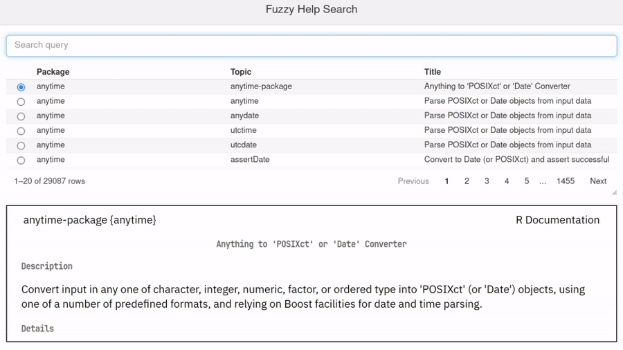

RStudio IDEを開発するPosit PBCが[Table Contest: 2024 Edition](https://posit.co/blog/announcing-the-2024-table-contest/)を開催しています。

表を使ったデータの可視化の例を思い思いに投稿してもらい、その中から受賞者を決めて、Tシャツやマグカップなどのノベルティを進呈するプログラムのようです。
[polars](https://pola-rs.github.io/r-polars/)パッケージを使って投稿した人には特別な受賞枠もあるようです。
2022年にも同様のコンテストがありましたが、今年はR言語に限らず、Python言語を使っての投稿もOKとのこと。

私は近ごろ開発していた`felp::fuzzyhelp()`を投稿しました。
これはRでヘルプ・Vignetteをあいまい検索するShinyアプリケーションです。
検索結果の表示・選択に[reactable](https://glin.github.io/reactable/index.html)パッケージを使っています。

作品は <https://atusy.shinyapps.io/fuzzyhelp/> で公開しているので、実際に誰にでも使い心地を試してもらえます。
デモ動画は以下。

コードのシンタックスハイライトなど、一部の機能はローカルにインストールした[felp](https://felp.atusy.net)パッケージの利用が必要です。
もし気に入ったらぜひ、`install.packages("felp")`してみてください。
GitHubリポジトリのスターもぜひよろしくお願いします。

<https://github.com/atusy/felp>

今回のコンテストを機に、`fuzzyhelp()`にはいくつか改善を加えました。
まだCRANには改善版を投稿していないので、早く投稿しようと思います。

-   表の行間を詰め、フォントを少し小さくすることで、少しでも大くの検索結果を一度に表示する
-   表の偶数行と奇数行で背景色を変え、目がすべりにくくする
-   カーソルが重なっが行の背景色を目立たせる
-   [memoise](https://memoise.r-lib.org/)パッケージを使って、一度使った検索キーワードの結果表示を速くする

これで随分と使い勝手がよくなったと思います。
パフォーマンスについてはまだまだ改善の余地があると思うので、なんとかしていきたいですね。

あと、今回が初の挑戦となったことに、[shinyapps.io](https://shinyapps.io)を使ったShinyアプリケーションの公開があります。
といっても、公式ドキュメント通りに作業すればあっさり投稿できるので、特に難しいことはなかったです。

<https://docs.posit.co/shinyapps.io/getting-started.html#working-with-shiny-for-r>

コンテスト自体は、Shinyアプリケーションでなくとも様々な表を受け付けてますので、我こそはという人は投稿してみてはいかがでしょうか。
月末が期限ということもあってか、まだ7件しか投稿されてなさそうで、案外勝目もあるかも......？

<https://forum.posit.co/tag/table-contest-2024>

**ENJOY**
