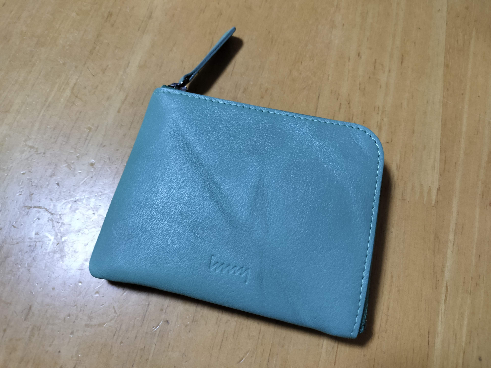
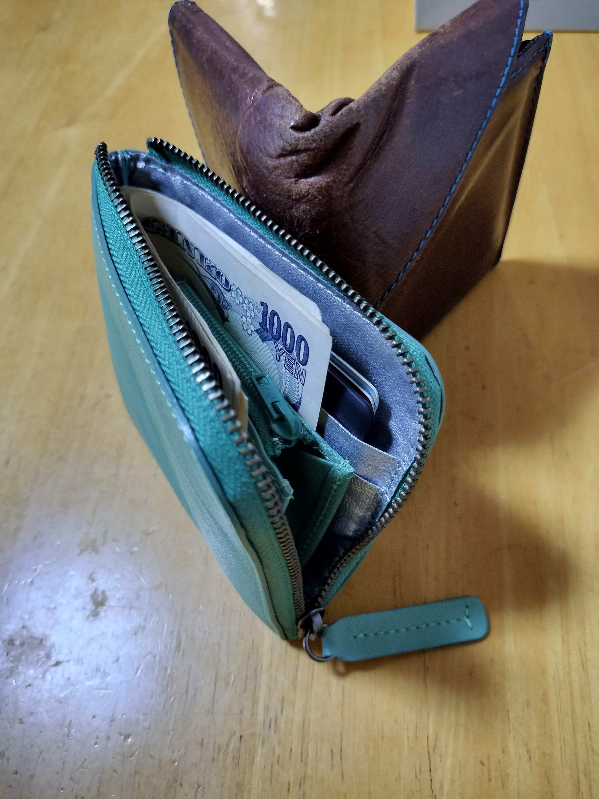

```{r, include=FALSE}
```

10年以上、アブラサスの[旅行財布](https://superclassic.jp/products/40601)を使っていましたが、この度、hmny casualの[コンパクト財布](https://store.ruboa.com/?pid=122792979)に買い替えました。

写真はやや青みがかかってますが、実際には黄緑に近い色です。
皺の入りかたは個体差があり、1つと同じ商品がないところもステキ。



お札の入れかたは小銭入れを取り巻くようにする方法と、折り目つけて小銭入れの脇に入れる方法があります。
前者は特にお札を入れるときに、ファスナーと干渉しやすいとのレビューを見ましたが、1枚入っていれば、2枚目からは内側に内側にと入れることでスムーズに入れられます。
ストレスなく使えています。
お札を普段より1枚多めにいれたり、利用頻度の低い高額紙幣や金券を外側に入れておくといいかもしれません。

カード入れも幅9cmちょいあり、複数枚入れたり、大き目のカードを入れたりできる余裕があります。
良い買い物をしました。



これまで使っていた旅行財布はコンパクトながらに、収納力と取り回しの良さがあります。
ただ、構造上、財布をかばんに入れると、鞄の中で向きが変わってしまい、小銭がこぼれることがあります。
かつては、財布をポケットに入れてることが多く問題にならなかった部分ですが、最近は鞄にしまうことが増え、不便に感じていました。
さらにキャッシュレス化で収納力や小銭の取り回しのよさも追求する必要は減ったかなと感じたことや、古くで内側の生地がほつれてきたこともあり、買い替えを決意しました。

どんな財布にするか、非常に悩みましたが、以下を条件に挙げたところ、L字ファスナーの財布がよさそうと考えました。

1. ポケットにも入るコンパクトさ
2. 鞄の中に入れても小銭がこぼれず、他の荷物と干渉しない
3. お札を折らずに収納できる
4. レシートも入れられる

この観点で財布を比較するとこんな感じ。

|    | 1 | 2 | 3 | 4 |   |
|----|---|---|---|---|---|
| L字ファスナー | o | o | o | o | 製品によってはお札を折る必要あり |
| 長財布 | x | o | o | 大きすぎる |
| 二つ折り | o | △ | o | o | 小銭はこぼれないだろうが、鞄の中で財布の折り目に小物が挟まったりしそう |
| 三つ折り | o | o | △ | o | お札が折れることしばしば |

小銭入れを分ける手もありますが、管理対象が増えると忘れ物したり、レジであたふたする未来が見えるので、却下しました。

L字ファスナーに絞っても選択肢は多いです。
色々調べて、以下の候補があがりました。

- [hmny casual コンパクト財布](https://store.ruboa.com/?pid=122792979)
  - 6,600円で安い
  - カラバリ豊富
  - 小銭入れにマチがあり、取り出しやすそう
  - 小銭入れにファスナーがあり、小銭がこぼれない
  - しわのある革がかわいい
  - 内側がシルバーの生地でおしゃれ
- [CRAFSTO ブライドルレザー L字ファスナー財布](https://crafsto.jp/products/sw-005-br?utm_source=youtuber&utm_medium=aff&utm_campaign=aff_cv&utm_term=takabon&utm_content=m1&variant-color=black&variant=32893742317697)
  - 約3万円で高級
  - 小銭入れの形状が工夫されていて、取り回しがよさそう
  - とにかくかっこいい
- [Boosters ブエブロレザー L字ショートウォレット](https://item.rakuten.co.jp/freespirits/wallet00976/?scid=af_pc_etc&sc2id=af_101_0_0)
  - 6,000円で安い
  - カラバリ豊富
  - お札入れにマチがあり、状況に合わせて大容量化できる
  - 小銭入れにマチがないので、取り出しにくそう
- [土屋鞄 ナチューラ ヌメ革Lファスナー](https://tsuchiya-kaban.jp/collections/lfas/products/na-l-zip-purse)
  - 8,800円で手頃
  - カード入れを省いていて、シンプル
  - 小銭入れにマチがないので、取り出しにくそう
  - 外見がシンプルすぎて、個性がない

正直、どれを選んでも後悔しないんじゃないかと思います。
CRAFSTOだけはお高いので購入のハードルは高いですが……。

機能面ではhmnyかCRAFSTOかなと思いました。
ただ、CRAFSTOは高い。
10年使えば年間3000円とは言え、L字ファスナー初挑戦で高級品を現物見ずに買うのは躊躇われました。

hmnyについては、L字ファスナーこそ実物を見る機会がなかったですが、2つ折りの[W-012](https://store.ruboa.com/?pid=69516554)を店舗で見かけ、その皺のよった革がかわいいなと印象に残っていました。
加えて、一番好みの色があったのが、決め手になりました。

次の10年をhmnyと付き合えるといいなと思います。

**ENJOY!!**
