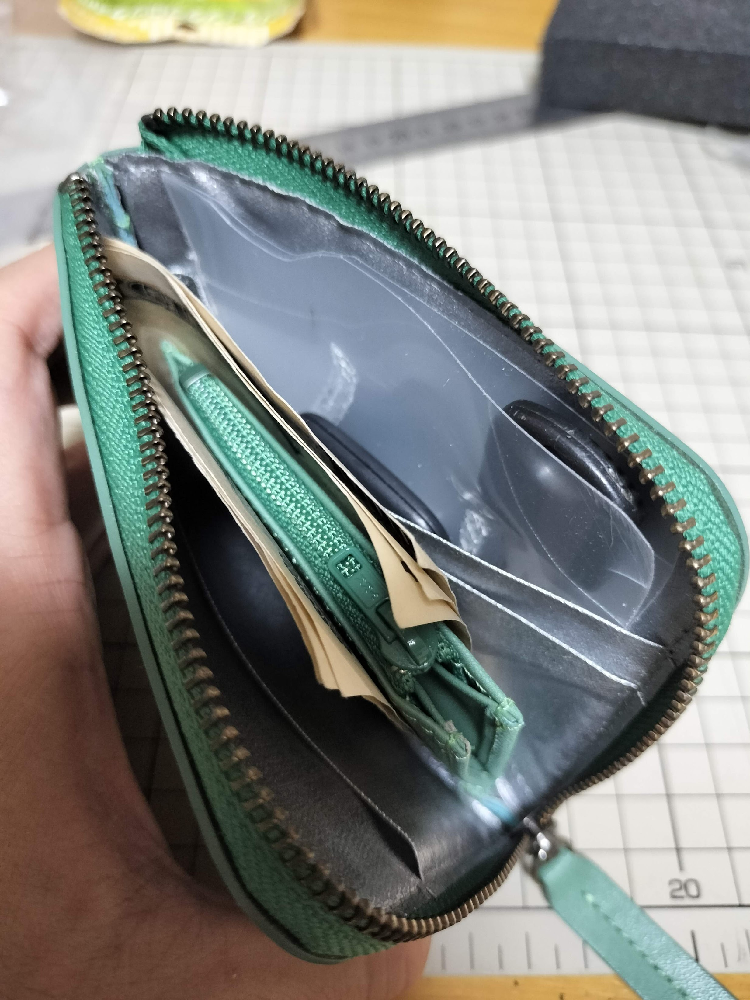
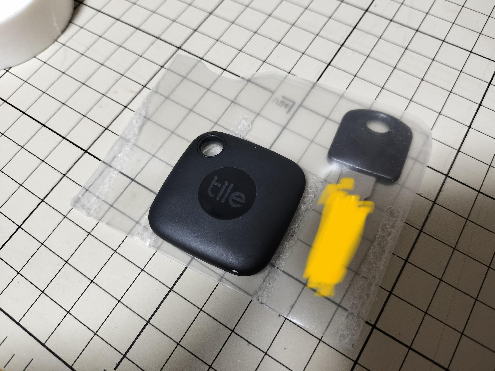
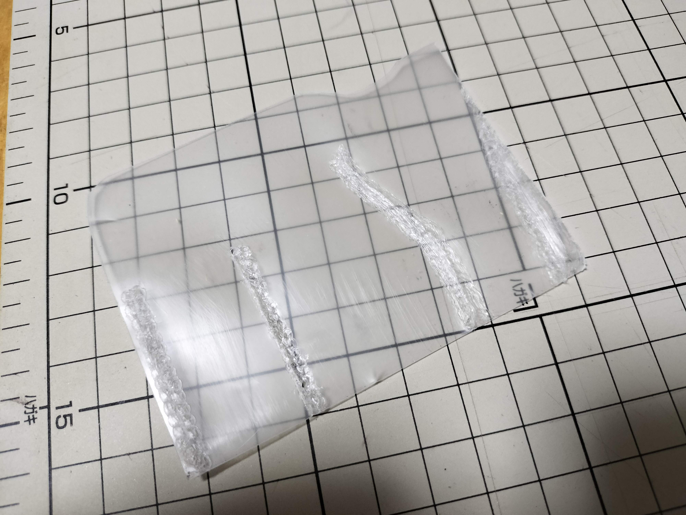

```{r, include=FALSE}
```

昨日の記事で紹介した[hmnyのコンパクト財布](https://blog.atusy.net/2024/09/20/hmny-wallet/)に入るキーケースを作りました。
クリアファイルを加工しているので薄くて軽くて丈夫です。
逆さにして振っても鍵が落ちてこない絶妙なホールド力も実現。
ハンドメイドなので、自分の鍵にサイズを合わせられるメリットが活きています。



自宅と自転車の鍵が入ります。
間にはマスキングテープでスマートタグの[Tile](https://www.thetileapp.jp/)を貼りつけています。
これで最低限必要な鍵は財布と共に持ち歩けます。
トラッキングも鍵と財布で分けずに一元化できます。



空の状態はこんな感じ。
クリアファイルから必要なサイズを切り取って、鍵の形に合わせて溶着しています。
クリアファイルはポリプロピレン製で230度～280度の温度で溶着できるとのことだったので、温度調整機能つきのはんだごてを270度に設定して使いました。
こて先が広めな面状のものを使うと、もう少し仕上がりがよかったかもしれません。



ポイントは、溶着していないあそびを残しておくことで、これが鍵の入れやすさに繋がります。
あと、財布本体を傷つけないように、角を丸くし、エッジや溶着部をやすりがけしています。

ビニールや革の既製品も見かけ、自分の財布に入れた時の使いやすさを求めたところ、自作を思いつきました。
余りがちなクリアファイルを再利用できる上に、実用性もあって、気にいっています。

**ENJOY!**
