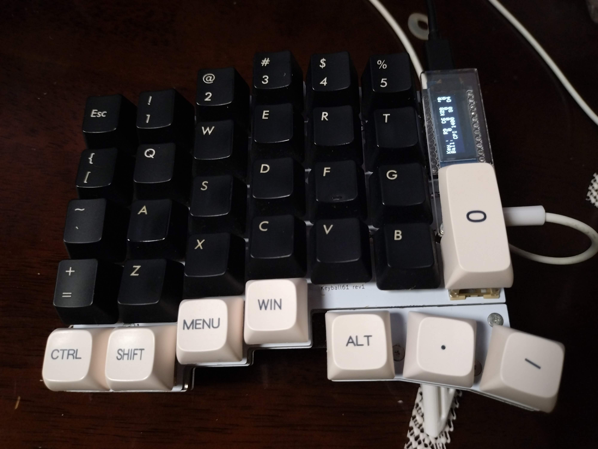

TTC Silent Bluish White Tactile Switchを購入しました。

別所での評判の通り、押し始めのタクタイル感が強く、そのあとすとんと落ちる感じ。
静音性も高い。
軸のグラつきも気にならない。

> 2021/03/28 （日）　TTC製タクタイルキースイッチ3種に触れる  
> <https://morning-sneeze.hatenablog.com/entry/20210329/1616952056>

私はこれまでEverglide Dark Jadeを使っていた。
タクタイル感がとてもここちよいスイッチ。
静音ではないが、コトコトとした打鍵音がとてもよい。
軸はそこそこグラつくが私は気にならない。
しかし、ノイキャン機能の弱いオンライン会議サービスを使っている場合のノイズが気になっていた。

そこで、一度試したのはKailh Midnight Silent V2 Switch / Tactileだった。
こちらは静音性は高いが、タクタイル感がやや弱い。
軸の安定性はTTC Silent Bluish White Tactile Switchよりも強固。
常用してもよかったが、私のキーボードの相性の都合でお蔵入りしていた。

私はKeyball 61を利用している。
通常、最も内側のキーには1uのキーキャップをつけるが、私はキーキャップを加工して、2uのキーキャップをつけている（画像の`0`の部分）。
こうすると、人差し指での打鍵が楽になる。
ただし、南北方向にある程度遊び（グラつき）のあるキーでないと、打鍵しにくい。
このため、Kailh Midnight Silent V2 Switchは使いにくかった。
TTC Silent Bluish White Tactile Switchは、この遊びがあるため、打鍵しやすく、かつ静音性も高いため、即採用となった。

今回、TTC Silent Bluish White Tactile Switchを35個購入したため、Keyball 61のキースイッチすべてを交換するには至っていない。
そのため、利用頻度の低いキーをKailh Midnight Silent V2 Switchにしている。
TTC Silent Bluish White Tactile Switchの追加購入も検討したいところだ。

このブログもTTC Silent Bluish White Tactile Switchで書いている。
一点気付いたのは、Everglide Dark Jadeの底打ちの響きも1つのフィードバックとして機能していて、運指の助けになっていたことだ。
逆に言うと、底打ちしまくっていたということであり、指に負担はかかりやすかったであろう。
底打ちの少ない打鍵を身につけてみたい。

ENJOY!
