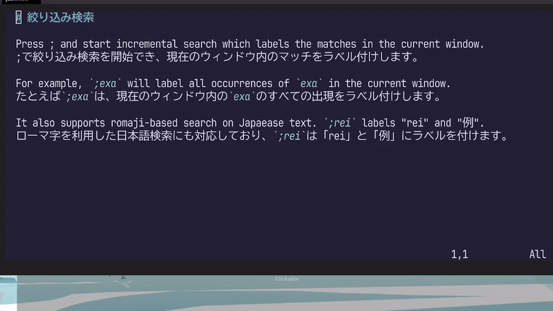

```{r setup, include=FALSE}
knitr::opts_chunk$set(comment = "#>", collapse = TRUE)
```

[3-shake Advent Calendar 2024](https://qiita.com/advent-calendar/2024/3-shake)の202f-12-09の記事です。
昨日はnnaka2992さんの[KubeCon NA 2024: The Future of DBaaS on Kubernetesのセッションレポート](https://nnaka2992.hatenablog.com/entry/2024/12/08/kubecon_na_the_future_of_dbaas_ob_kuberneteS)でした。

私は土曜までJapan.Rの発表準備で忙しかったので、アドカレをまったく読めてません。
これから追いかけたいと思います。

さて本題。
会社で使われているエディタはVS Codeユーザーが圧倒的多数を占めてると思います。
それでもNeovimに興味を持ってもらえると嬉しいなと思って、「オレのNeovim見て！」というタイトルで社内LTしました。

この記事は社内LTの内容をベースに書いてます。
Neovimの使い方とか詳しいことには触れず、こんなことできるんだぞー！見てみて！という感じの内容です。

- Vim/Neovimってターミナルと仲良しな人向けのあれでしょ？
- 文字入力や保存・終了すら直感できない初心者殺しのあれでしょ？

まあそうかもしれないけど、今日の話で、ちょっとでも興味もってもらえると嬉しいな！

# Neovimとは？

ともあれ、Neovimを知らない人向けの記事でもあるので、簡単にNeovimについて説明します。

2014年にVimから派生したテキストエディタ。
Vimからとの互換性を極力保ちつつ、新しい機能の追加・変更を行っている。

- LSPクライアントの内蔵
- AST解析機能
    - シンタックスハイライトなどに使える
- terminal emulator
    - Vimも後追いで対応
- floating window
    - Vimにはpopup windowという似た機能があるが、フォーカスできない（現在対応中）
- Lua言語による設定

といってもforkから10年が経ち、**できること**の差は小さくなっている気がする。

# なんでVim/Neovimなの？

かっこいいから！はTRUEだけど……。

本質的にはモードというコーディングに適した機能があるから。

**コーディング ≠ 文字入力**なので、案外文字入力（インサート）する場面は限られる。

- 準備
  - ファイル選択
  - カーソル移動
- コードリーディング
  - 関数の使い方確認
  - 検索
- 文字入力によらない編集
  - コピペ
  - 置換
  - Undo/Redo
  - 行結合

など。

Vimでは文字入力しないノーマルモードを中心として、様々なモードを行き来する。

```
ノーマルモード ⇔ インサートモード（文字入力）
                  ビジュアルモード（文字選択）
                  コマンドラインモード（検索・置換などいろいろ）
                  ...
```

ノーマルモードでやるには複雑すぎることは他のモードに任せる。
終わったらノーマルモードに戻る。

え？複雑だって？インサートモードだけの世界観で色々やってるほうが複雑なんよ！
モードごとにやること絞ってるほうがシンプルっしょ！
（諸説あります）

# まあとりあえずオレのNeovim見て！

プラグイン増し増しで色々できるよ！
とりあえずこの記事では見た目にインパクトありそうなこと紹介するよ。

## 補助ラベルによる効率的な操作


自作プラグインにより、補助ラベルを使った効率的な操作が可能です。

- <https://github.com/atusy/jab.nvim>
- <https://github.com/atusy/treemoneky.nvim>

類似のプラグインは多数ありますが、私のユースケースを満たさなかったので自作しました。

### 行内の移動

- <https://github.com/atusy/jab.nvim>

Vim/Neovimには`f<文字>`と入力すると指定した文字にカーソルを移動させる機能があります。
プラグインによる発展形として、指定した文字にマッチする箇所にラベルをつけ、ユーザーが選択したラベルに移動することができます。

たとえば、以下の例では`f<space>`と入力することで、カーソル右側のスペースにabcd...とラベルがつき、好きなラベルを選択して移動しています。
また、ローマ字を応用して日本語に対してもジャンプ可能で、`fn`と入力することで、「に」や「日」にジャンプすることもできます。


`f<space>`ならカーソル右側に注目しますが、`F<space>`で左側に注目するなんてこともできます。
`df<space>`などとすると、選択箇所まで削除も簡単です。

### 表示範囲内の絞り込み検索

- <https://github.com/atusy/jab.nvim>

通常の検索では、候補を「前へ」や「次へ」で移動しますが、プラグインの力を使うと表示領域内の候補にラベルをつけて選択したラベルに移動できます。
何度も「次へ」する苦労から解き放たれます。

以下の例では`;`を検索開始キーとしており、`;exa`と入力するに従って「e」にマッチ、「ex」にマッチ、「exa」にマッチと、絞り込んでいます。
先程の行内の移動と同様に、ローマ字を応用して日本語に対してもジャンプ可能で、`;rei`と入力することで、最終的には「例」にジャンプしています。



### 範囲選択

- <https://github.com/atusy/treemoneky.nvim>

プログラミングである範囲を削除したりコピーしたりしたいとき、たいてい範囲はプログラミング言語における意味のある塊です。
NeovimはTreesitterを用いた構文解析機能を内蔵しているので、解析結果を利用して範囲の両端にラベルをつけ、選択可能なプラグインを作りました。


既存プラグインは、ラベルを1度だけ選択しますが、私のプラグインでは必要に応じて段階的な選択を行います。

たとえば以下のように`n`にカーソルがあるとき、選択したい範囲は`print`かもしれませんし、`print("Hello, world")`かもしれません。
しかし、どちらのケースも左端は`p`です。
このため、左端を示すラベルが`a`と`b`の2つになり重なってしまいます。
ユーザーは見えているラベルを選択するしかないので、いったんは見えている方を選択するしかありません。
従来プラグインでは、選んでみるまで`print`と`print("Hello, world")`のどちらが選ばれるか分かりませんでした。
私の[treemonkey.nvim](https://github.com/atusy/treemoneky.nvim)はここを解決した形です。

```
print("Hello, world!")
 # ^このnにカーソル
```

詳しくは[Neovimで文法に従ってコードを範囲選択するtreemonkey.nvimを作った](https://blog.atusy.net/2023/12/27/treemonkey-nvim/)を御一読ください。

### ウィンドウの移動

- <https://github.com/tkmpypy/chowcho.nvim>

Vim/Neovimではhjklでカーソルを左下上右に移動できます。
そのアナロジーで、`CTRL-W` + `CTRL-K`すると、現在のウィンドウの上側に移動できます（注：ウィンドウはVS Codeなどでいうペインに近い概念です）。

しかし、たとえば以下の例で3にカーソルがあるとき、`CTRL-W` + `CTRL-K`の移動先は1でしょうか2でしょうか？
熟練のVimユーザーには明らかかもしれませんが、初心者にはわかりにくいです。

```
+---+---+
| 1 | 2 |
+---+---+
|   3   |
+---+---+
```

この問題も、ウィンドウごとにラベルをふって移動先を明示的に指定することで解決できます。

発展的な用途として、選択したウィンドウを閉じる、現在のウィンドウと選択したウィンドウを入れかえるといったこともできます。
プラグイン作者はtkmpypyさんですが、この機能は私が追加しました。

> [chowcho.nvimで任意の関数を、対話的に選択したwindowで実行](https://blog.atusy.net/2022/07/31/chowcho-nvim-any-func/)

## 操作中のファイルを分かりやすくする

複数のファイルが画面上に並んでいると、編集中のファイルがどれかわかりにくくなることがしばしばあります。

そこで私は、styler.nvimというプラグインを使って、状況に応じてウィンドウの色を変えています。
たとえば、以下の順で背景色を目立つものにしています。

- ツールチップ的に表示している関数のヘルプ
- アクティブウィンドウ
- その他


他にも、プロジェクト外部のファイルをまったく異なる色にして、意図せず編集することを防ぐなどの工夫もしてます。

詳しくは以下の記事を御覧ください。

> [もっと良い感じにstyler.nvimでアクティブなウィンドウか否かでカラースキームを変える](https://blog.atusy.net/2022/12/17/styler-nvim-active-win/)

これはそこそこ設定が混み入っているので、近くプラグイン化して誰でも使えるようにしたいですね。

# ENJOY!

見た目が派手そうな機能を紹介しましたが、`[foo]`を`(foo)`に置き換えるような括弧の操作や、イマドキのIDEのようなAI利用だったり、他にも様々なことができます。

お世事にも始めやすいエディタではないと思いますが、興味をもてたら触ってみてもらえると嬉しいです！
