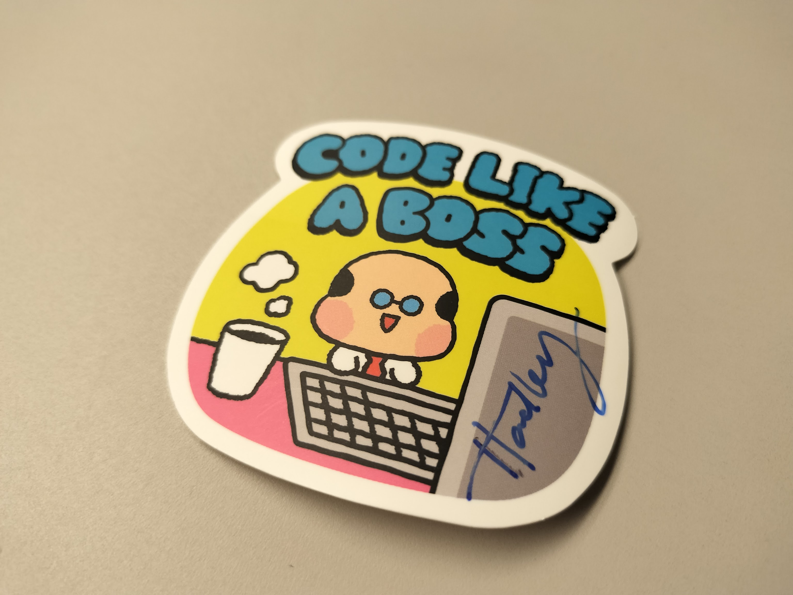

```{r setup, include=FALSE}
knitr::opts_chunk$set(comment = "#>", collapse = TRUE)
```

2024-12-07に開催されたJapan.R 2024に参加しました。

> <https://japanr.connpass.com/event/334154/>

当日は以下の2本で発表しました。

- [Happy Structured Loggin in R（構造化ログ入門.R）](https://atusy.github.io/japanr-2024-logging/)
- [Osaka.Rについて](https://github.com/atusy/japanr-2024-osakar)

発表の感想は既に記事にした通りですが、発表以外の部分についても少し書いておきます。

今回はRを実務で使う話やRをProduction環境で使う話が多かったです。
rockerやrenvなどの普及で、コミュニティが成熟してきたのかなあと感慨深くなりました。

2019年以来のオフライン開催で久しくお会いしていなかった方とお話できたこと、光栄にも私に会ってみたかったという方に挨拶頂けたりブログが参考になったと言っていただけたこと、発表に対して直に感想をやりとりできたことなど、現地入りしてよかったなあと思います。

運営の皆様に感謝を。来年もまたお会いできると嬉しいです。

恥ずかしながら、今回は2本の発表を控えていたため、序盤は発表準備とそわそわで話が半分くらいしか入ってこず、後半は疲れきって頭が回らなくなっていました。
特にLT後半にあった「RでHex」では、Rといえば何角形かという質問に対し、五角形と答えてしまいました。
Rの上の部分を見てたらですね、朧げながら浮かんできたんですよ、五角形が。

はい、Rといえば六角形ですよね。
tidyverse由来（？）でパッケージのロゴに六角形を使う風潮があります。

私自身、六角形ロゴをデザインしたことがあるというのに……。

> 腸閉塞番外編: 入院中だって楽しいことしたいので、個人開発してるプログラム "felp" のロゴをデザインした 
> <https://note.com/atusy/n/ne63baed8c2ff?magazine_key=mc989345b5fc3>

# セッション1

統計手法Shinyアプリの実用例など、実務に直結するし、聴衆も試してみたくなるような内容が多かったセッションでした。

個人的にはOsaka.Rについてのコミュニティトークの準備が間に合ってなくて、聞きながら資料作りしてた一番恥の多いタイミング。

自分が触れたことない分野の技術が出てきて、こういうの聞いてこそ勉強会だよなあと思いました。
あと、カイ二乗検定を理解する上で、古典を学び、ベイズで解釈しなおし、古典に戻るという話は面白かったです。
私としても回帰分析（特にGLMMなど複雑なやつ）の気持ちの理解が一番進んだのはStanでモデリングした時でした。
視点を変えると理解が進むことってあって、その経験を共有してくれるのはとてもいい試みだなと思いました。

# ランチ

元々は会場内で適当にすます予定でしたが、きぬいとさんのお誘いに乗って4人でランチに。
蕎麦を食べに行きました。

LLMの活用の話が特に盛り上がったかな？
あと、テレビ業界の話もしてた。
あかん、もう記憶が薄れつつある。

# キーノート

Hadley氏によるキーノート。
来日3回目とのことですが、希少な機会ですね。

Rを本番環境で使っていくために心得てとくといいうことをざっくり話していただきました。

DevとProductionってなにが違うの？というところから、バージョン管理、データスキーマの変化、ログの重要性などについて広く共有してくれました。

丁度、私はセッション2でログの話をするつもりだったのもあり、Hadleyが先に話してくれたのはすごくありがたかったです。
あまりの嬉しさに、質疑の時間に先鋒を切らせていただきました。
感謝を述べただけで、大した内容ではなかったのですが、こういう軽い内容でとりあえず場を温めたほうが、他の人も質問しやすいかなーとかいう打算もあったりします。

質疑の時間は15分くらいあった気がしますが、絶える様子なく、大人気でした。

# セッション2

Hadleyに続く形でプロダクション環境や実務でRを使うことに関する話題が飛び交った印象深いセッション。
パッケージやPositronの話題もあり、実に多岐にわたる内容でした。

個人的には

> Lessons Learned from Deploying R Models in Production Environments / 本番環境へのR言語モデルのデプロイから学んだ教訓
> <https://qiita.com/Gotoubun_taiwan/items/bceb9ba52453e915852b>

が特に印象に残りました。

Rを使ったスケーラブルなシステムを構築するにあたり、APIの受け口はGoで実装して、RでしかできないことだけをRでやるというアプローチ。
基盤としてLambdaを採用することで、スケールアウトを実現しているとのことでした。
凄くいいと思います。

私も昔はRでなんでもやりたくなっていたタイプですが、plumberでAPIを実装するにしても、ShinyでWebアプリを実装するにしても、課題は多いなと思っていました。

なんといっても型ヒントすらないのは辛い……。
特に、REST APIを実装するにあたっては、開発初期はなんとかなっても、後々バリデーション回りで苦労しそうなイメージがあります。
Shinyもさくっとウェブアプリを作るには便利ですが、やればやるほどWeb側の知識も欲しくなってしまうので、じゃあイマドキのフロントエンドフレームワーク（Remixとか）使った方が幸せでは？と思ってしまいます。

あと、他の言語に比べるとシステム開発回りのノウハウの蓄積に差があるため、R以外を使っておいた方が躓きや負債が生まれにくいかなと思います。

一方でRは統計関係のパッケージの豊富さが随一なので、システムに局所的にRを組込むというのは実に理に適っていると思います。

# コミュニティトーク

各地方のRコミュニティの活動紹介がありました。
懇親会を重視されているコミュニティが多かったのが印象的。
わかる。
昨今は発表資料がインターネット上に公開されることも多いので、なんとなくであれば内容を後から追うことも可能です。
一方で懇親会は一期一会な度合いが強いですよね。

発表そのものも、オフラインの方が個人的には好き。
この感覚は今回の発表を通じて改めて深まりました。

- [Japan.R 2024で構造化ログについて発表した](https://blog.atusy.net/2024/12/10/japanr-logging/)
- [Japan.R 2024で地域コミュニティのOsaka.Rについて発表した](https://blog.atusy.net/2024/12/12/japanr-logging/)

地方R巡業したい……。

とりあえず、まずはFukuoka.Rですかね。
運営の藤野さんが、大学でキャリアの話をしてくれる人を募集していて、手をあげてみたので、その時セットでFukuoka.Rを開催してもらえたりすると嬉しいなあ。

# ライトニングトーク

もうこの頃には精も魂も尽きていました。

R界隈にもNixユーザーがそれなりにいるっぽいのが印象的。
もう一度頑張ってみようかな。

毎度恒例「Japan.R 2024で構造化ログについて発表した」はめちゃ面白かったです。

他にも「R×LINEの可能性を伝えたい！」とか皆さんの知見がいっぱい集っていてよかった。

# 閉会後

Hadleyをつかまえてサインしてもらいました！
会場提供のLY社が配布してくれていたステッカーにサインしてもらったので、Japan.R 2024でしか手に入らない貴重な思い出になりました。
感謝。



あ、ツーショットもお願いしたらよかった……。

このあと懇親会にも行ったのですが、ログの取り方について議論させていただいたり、非常に気さくな御仁でした。

# ENJOY!!

また会いましょう！

