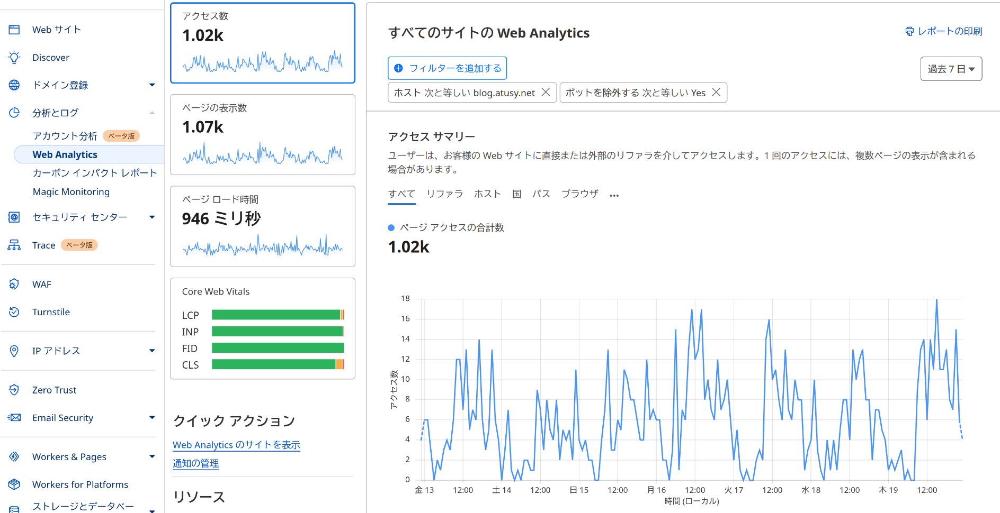

```{r setup, include=FALSE}
knitr::opts_chunk$set(comment = "#>", collapse = TRUE)
set.seed(123)
```

Cloudflare上でドメインを管理していると、Web Analyticsを利用できる。
たとえば、私のブログのアクセス解析はこんな感じ。
ホスト名やリクエストパス、期間などでフィルタリングもできて便利だが凝った情報の可視化には向いてなさそうだ。



というわけでAPIが欲しい。
調べたところ、GraphQL Analytics APIを使えばいいらしい。

> https://developers.cloudflare.com/analytics/graphql-api/

基本的には、

- Overview -> Authentication -> Configure an Analytics API Tokenに従って**Account Analytics**の権限をつけたAPI Tokenを作成
- 作成したトークンと、Cloudflareに登録のメールアドレスを使ってリクエストする

で使える。難しいことはない。

たとえば以下のように空のクエリを発行すると、``"must have a single query"``というエラーが返ってくることを確認できる。`

``` bash
API_TOKEN=""
X_AUTH_EMAIL=""
curl 'https://api.cloudflare.com/client/v4/graphql' -H "X-AUTH-EMAIL: $X_AUTH_EMAIL" -H "Authorization: Bearer $API_TOKEN" --data-binary '{"query":"","variables":{}}'
# {"data":null,"errors":[{"message":"must have a single query","path":null,"extensions":{"timestamp":"2024-12-19T14:43:11.174898552Z"}}]}
```

認証に失敗していればエラーが返る。

```json
{"success":false,"errors":[{"code":9106,"message":"Missing X-Auth-Key, X-Auth-Email or Authorization headers"}]}
```

で、あとはGraphQLのクエリを組み立てればいい。
[Explore the GraphQL schema](https://developers.cloudflare.com/analytics/graphql-api/getting-started/explore-graphql-schema/)によると、GraphiQLやAltairなどのGraphQLクライアントに付属のDocs機能でスキーマを確認できるらしい。
どういうわけかAltairでは確認できなかった。

挫けそうになるのだが、Cloudflare上のウィジェットもGraphQLで動いているようで、ブラウザの開発者ツールを使ってクエリをキャプチャできるとのこと。
ここまで解説してくれてるCloudflare、ありがたい。

> Capture GraphQL queries with Chrome DevTools
> https://developers.cloudflare.com/analytics/graphql-api/tutorials/capture-graphql-queries-from-dashboard/

というわけで、冒頭のスクショの情報を得るには以下のようなクエリと変数を使えばいいようだ。

``` graphql
# クエリ
{
  viewer {
    accounts(filter: {accountTag: $accountTag}) {
      series: rumPageloadEventsAdaptiveGroups(limit: 5000, filter: $filter) {
        count
        avg {
          sampleInterval
          __typename
        }
        sum {
          visits
          __typename
        }
        dimensions {
          ts: datetimeHour
          __typename
        }
        __typename
      }
      __typename
    }
    __typename
  }
}
```

``` json
# 変数
{
  "accountTag": "265d37afad0de61a8c2ecff11a0778a2",
  "filter": {
    "AND": [
      {
        "datetime_geq": "2024-12-12T14:23:19Z",
        "datetime_leq": "2024-12-19T14:23:19Z"
      },
      {
        "requestHost": "blog.atusy.net"
      },
      {
        "bot": 0
      },
      {
        "OR": [
          {
            "siteTag": "d2cd674b28a147368bc4d2f650daec34"
          },
          {
            "siteTag": "06375283fdc747e18b27ea2c9f650bc9"
          }
        ]
      }
    ]
  }
}
```

特定のページのログを見たければ、変数の`.filter.AND`に以下を追加すればいい。

``` json
      {
        "requestPath": "/2018/11/10/ggplot2-legend-pos-n-just/"
      }
```

Cloudflareのウィジェットを見るに、保管されているデータは過去半年分で、一度に30日分取得できる。
`for`ループを頑張れば全データを取得できるはずだ。

GraphQLクライアントのaltairで試しに実行した後、curl用にコピーしたコマンドは以下。

``` bash
API_TOKEN=""
X_AUTH_EMAIL=""
curl 'https://api.cloudflare.com/client/v4/graphql' -H 'Accept-Encoding: gzip, deflate, br' -H 'Content-Type: application/json' -H 'Accept: application/json' -H 'Connection: keep-alive' -H 'Origin: altair://-' -H "X-AUTH-EMAIL: $X_AUTH_EMAIL" -H "Authorization: Bearer $API_TOKEN" --data-binary '{"query":"{\n  viewer {\n    accounts(filter: {accountTag: $accountTag}) {\n      series: rumPageloadEventsAdaptiveGroups(limit: 5000, filter: $filter) {\n        count\n        avg {\n          sampleInterval\n          __typename\n        }\n        sum {\n          visits\n          __typename\n        }\n        dimensions {\n          ts: datetimeHour\n          __typename\n        }\n        __typename\n      }\n      __typename\n    }\n    __typename\n  }\n}","variables":{"accountTag":"265d37afad0de61a8c2ecff11a0778a2","filter":{"AND":[{"datetime_geq":"2024-12-12T14:23:19Z","datetime_leq":"2024-12-19T14:23:19Z"},{"requestHost":"blog.atusy.net"},{"bot":0},{"OR":[{"siteTag":"d2cd674b28a147368bc4d2f650daec34"},{"siteTag":"06375283fdc747e18b27ea2c9f650bc9"}]}]}}}' --compressed
```

**ENJOY!!**
