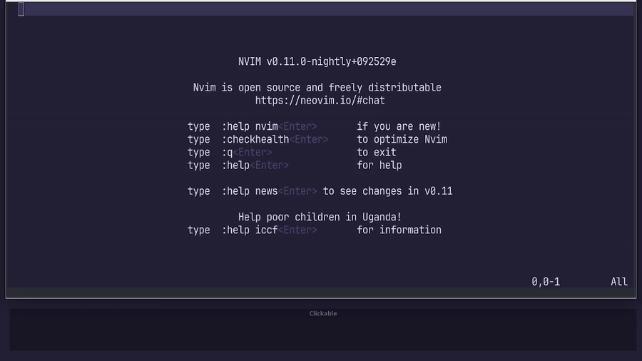

```{r setup, include=FALSE}
```

[Vim駅伝](https://vim-jp.org/ekiden/)2025-03-12の記事です。


最近、NeovimがOSC 133に対応しました（< https://github.com/neovim/neovim/pull/32736>）。

これにより、OSC 133に対応したシェルのユーザーであれば、`[[` や `]]` を使って、`:terminal`内のシェルプロンプト間をジャンプできるようになります。

大量の行に渡る出力が発生した場合に、出力がどこから始まっているか、目で終わずにジャンプできるのは便利ですね。



ちなみに、TerminalモードからNormalモードに移行するには`<C-\><C-N>`ですが、私は`<C-\><C-O>`を使っていないので、単に`<C-\>`で移行できるようにマッピングしています。

さて、OSC133の利用にはシェル側の設定が必要です。
プロンプト文字の直後に特殊なエスケープシーケンスを出力します。

私はfishユーザーでプロンプトを自前実装しているので、`fish_prompt.fish`において、プロンプトの末尾に`printf '\e]133;A\e\\'`を追加しました。
Neovim内では問題ないのですが、Neovimの外、Weztermの中では、謎の改行が入る現象を確認しているので、`NVIM`環境変数の有無でOSC133の有効/無効を制御しています。
このあたりも追い追いなんとかしたい。

<https://github.com/atusy/dotfiles/blob/611557c1525f2e75ba2af610ebc0b5f1b40c1508/dot_config/private_fish/functions/fish_prompt.fish?plain=1#L64-L66>

Zshユーザーは以下の記事を参考にするとよさそうです。

> zshでOSC 133に対応する by Yoshi Yamaguchi \
> <https://zenn.dev/ymotongpoo/articles/20220802-osc-133-zsh>


## ENJOY!

前回はthincaさんによる「[Meguro.vim #28 を開催しました](https://thinca.hatenablog.com/entry/2025/03/megurovim-28)」でした。
継続できててすごい……。

次回はokmkmさんによる「Neovimを使い始めて半年経った若輩Vimmerが愛用しているプラグインの紹介」だそうです。
最近、プラグインの棚卸できてないので楽しみ！
