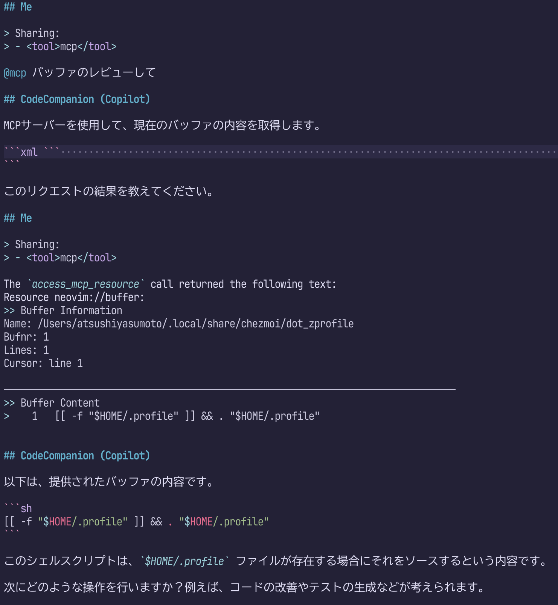

```{r setup, include=FALSE}
```

[CopilotChat.nvim]: https://github.com/CopilotC-Nvim/CopilotChat.nvim

MCP（Model Contezt Protocol）盛り上がってますね。

[やさしいMCP入門](https://speakerdeck.com/minorun365/yasasiimcpru-men)なんて資料も出てきたくらいです。

資料によると、MCPはAIエージェント用のツール接続規格で、ツールを通じて情報取得や外部操作ができるらしい。

最初はAnthrotopic社がなにやら独自の規格を出してきたなと思っていたのですが、このところ、ユーザーが自前実装してみる流れできたり、GitHubやAWSがオフィシャルにMCPサーバーを提供し始め、大きな波を感じます。

試しにNeovimで使ってみたところ、`@mcp このバッファレビューして`と入力するだけで、適切なMCPサーバーを勝手に選んでくれることを確認しました。
これはすごい。日本語でもいけちゃうところが、さすがAIという感じですね。



MCPがなくても、プラグインによっては`#buffer レビューして`などと入力することでバッファの内容をAIに共有することができました。
今回の例であれば速度の観点からも`#buffer`の方が有利ですが、用途ごとにコマンドを覚える必要があります。
`@mcp`を使うと必要なキーワードが1つで済むことが魅力ですね。
他のMCPサーバーも導入すれば、GitHubなど、codecompanion単体で入手することが難しい情報源を利用できる点も魅力です。

[mcphub.nvim]: https://github.com/ravitemer/mcphub.nvim

NeovimでMCPを使うには、[mcphub.nvim]をいれるといいようです。
LSPにおける[mason.nvim](https://github.com/williamboman/mason.nvim)のように、リッチなUIを通じてMCPの導入を支援してくれるプラグインです。

これとAIチャットを実現してくれる[codecompanion.nvim](https://github.com/olimorris/codecompanion.nvim)や[avante.nvim](https://github.com/yetone/avante.nvim)を組み合わせると、先の例のように、チャット画面で`@mcp`と入力するだけでMCPの利用を開始できるようになります。

## [mcphub.nvim]の導入

プラグインそのもののインストール方法はREADME.mdによくまとめられているので、ご参照ください。

<https://github.com/ravitemer/mcphub.nvim>

少し注意が必要なのは、[mcphub.nvim]は`~/.config/mcphub/servers.json`にサーバーの設定を記述するのですが、このファイルを自動生成してくれないようです。
とりあえず、以下の内容で作成しておくといいでしょう。

```json
{
  "mcpServers": {}
}
```

[mcphub.nvim]のインストールができたら、MCPサーバーをインストールします。

[mcphub.nvim]の推奨する方法に従うと、`:MCPHub`コマンドでUIを起動し、`M`でマーケットプレイスにアクセスし、欲しいものを選んで`<CR>`を押して……という流れを踏みます。
流れに従っていくと、最終的に、**codecompanion**や**avante**のチャット画面を通じて、サーバーのインストールに必要なコマンドの実行と`servers.json`の更新が行われます。
`pip install ...`していい？とか聞いてくれるので、こちらは承認するだけでよいのが凄いところ。

凄いのですが、個人的には、サーバーのインストールと`servers.json`の更新は手動で行ったほうがいいと感じています。
というのも、各MCPサーバーが推奨するインストール方法と、チャットを通じて提案されるインストール方法が異なるケースがあるからです。

たとえば[mcp-server-git](https://github.com/modelcontextprotocol/servers/tree/main/src/git)は、`docker`や`uv`を使った導入方法を紹介していますが、[mcphub.nvim]のUIを通じてインストールすると、`pip install`を実行するように指示されました。
また、MCPサーバーによってはAPI Tokenの入力が必要だったりもするので、公式ドキュメントを参照したほうが、余計なトラブルに出会わずすむと思います。

ちなみに[mcp-server-git](https://github.com/modelcontextprotocol/servers/tree/main/src/git)については自分が使いやすいように以下のように`servers.json`を編集しました。

```json
{
  "mcpServers": {
    "git": {
      "command": "uv",
      "args": [
        "tool",
        "run",
        "mcp-server-git"
      ]
    }
  }
}
```

## チャットプラグインへのMCP導入

[codecompanion.nvim](https://github.com/olimorris/codecompanion.nvim)や[avante.nvim](https://github.com/yetone/avante.nvim)でMCPを利用できるようにするには、チャットプラグインと[mcphub.nvim]の双方に設定を加える必要があります。

[mcphub.nvim]のREADME.mdには軽く言及がありますが、これだけを見るとかえって混乱すると思います。
README.mdの末尾に詳しいドキュメントへのリンクがあるので、こちらを参照するとわかりやすいです。

- avante: <https://github.com/ravitemer/mcphub.nvim/wiki/Avante>
- codecompanion: <https://github.com/ravitemer/mcphub.nvim/wiki/CodeCompanion>

## ENJOY

MCPをNeovimで使う様子と、使えるようにするまでの流れを紹介しました。
まだ活用に至ってませんが、これから少しずつ使ってみたいです。
