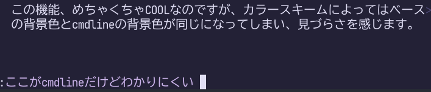
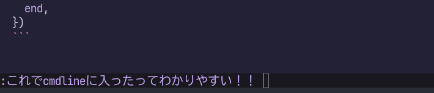
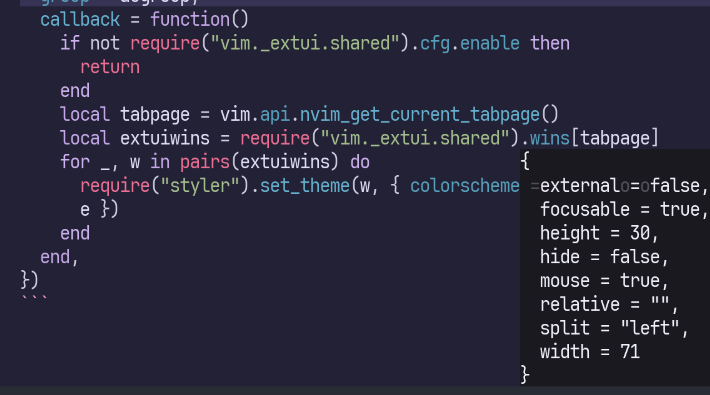

Neovim開発版のexperimentalな機能として、コマンドラインやメッセージをフローティングウィンドウ化するextuiが実装されました。
設定方法に関しては2025-05-09に公開された以下の記事を参考にしてください。

> [Neovim最先端のextuiでcool & smartなcmdlineを手に入れよう](https://zenn.dev/kawarimidoll/articles/4da7458c102c1f) by Kawarimidollさん

この機能、めちゃくちゃCOOLなのですが、カラースキームによってはベースの背景色とextuiの背景色が同じになってしまい、見づらさを感じます。



特にメッセージが既存のバッファとかぶったときは最悪です。


素朴には[`MsgArea`](https://neovim.io/doc/user/syntax.html#highlight-groups)のハイライト設定でも解決できますが、文字色との相性を考えるのは大変です。

extuiによるcmdlineがフローティングウィンドウであることを利用して、ウィンドウ単位で異なるcolorschemeを適用してみましょう。
[folke/styler.nvim](https://github.com/folke/styler.nvim)が大活躍します。

私は[EdenEast/nightfox](https://github.com/EdenEast/nightfox.nvim)の愛用者なので、ベースのcolorschemeに`duskfox`、extuiのcolorschemeに`carbonfox`を適用してみます。
experimentalな機能のソースコードに強く依存しているので、破壊的変更の影響を受ける可能性に留意しつつ使ってください。

```lua
-- 変更すべきパラメータ
vim.cmd.colorscheme("duskfox")
local extui_colorscheme = "carbonfox"

-- extuiのカラースキームを自動設定
local augroup = vim.api.nvim_create_augroup("atusy-extui-cmdline", {})
vim.api.nvim_create_autocmd("CmdlineEnter", {
  group = augroup,
  callback = function()
    if not require("vim._extui.shared").cfg.enable then
      return
    end
    local tabpage = vim.api.nvim_get_current_tabpage()
    local extuiwins = require("vim._extui.shared").wins[tabpage]
    for _, w in pairs(extuiwins) do
      require("styler").set_theme(w, { colorscheme = extui_colorscheme })
    end
  end,
})
```

これでcmdlineやメッセージの背景色が変化し、非常にみやすくなります。

cmdlineだと、効果はわかりにくいかも……？



メッセージは一目瞭然ですね！



**ENJOY**
