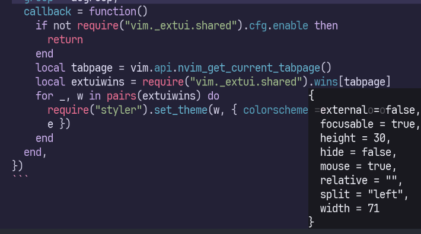

Neovim開発版のexperimentalな機能として、コマンドラインやメッセージをフローティングウィンドウ化するextuiが実装されました。

最高にcool & smartな機能で、設定方法に関してはkawarimidollさんが紹介してくれています。

> [Neovim最先端のextuiでcool & smartなcmdlineを手に入れよう](https://zenn.dev/kawarimidoll/articles/4da7458c102c1f) by Kawarimidollさん

しかし、もっとcoolにするためには色々と手を加えたほうがよさそうです。

一例として、先日はcmdlineのカラースキームを変更して視認性を上げる方法を紹介しました

> [Neovim最先端のextuiのcool & smartなcmdlineに特別なカラースキームをあててもっとcoolにしよう](https://blog.atusy.net/2025/05/10/nvim-extui-cmdline-styiling/)

今回は、extuiで表示されたメッセージボックスを任意のタイミングで非表示にする方法を紹介します。
次の画像の右下部分のやつですね。
`:= vim.api.nvim_win_get_config(0)`の結果を表示しています。



メッセージボックスは有効化時に、`.msg.pos = "box"`を指定するか、`vim.o.cmdheight = 0`を指定することで表示されます。
通常では`.msg.box.timeout`に指定した時間が経過すると自動で閉じますが、メッセージがあまりにも巨大だった場合など、すぐに閉じたい時があります。

```lua
require("vim._extui").enable({
  enable = true,
  msg = {
    pos = "box",
    box = { timeout = 5000 },
  },
})
```

しかし、メッセージボックスを直接非表示にするためのAPIは現時点で提供されていません。

通常のcmdlineにメッセージを表示するときと同様に`<C-L>`で非表示化する設定を作ってみましょう。

[`:h vim._extui`](https://neovim.io/doc/user/lua.html#vim._extui)によると、メッセージボックスのファイルタイプは`msgbox`らしいので、そんなバッファを表示しているウィンドウを見つけて、configに`hide = true`を指定してやればよさそうです。

`hide_msgbox`関数にそのロジックを実装してみます。

```lua
local function hide_msgbox()
  -- 表示中のウィンドウ一覧を取得
  local wins = vim.api.nvim_tabpage_list_wins(vim.api.nvim_get_current_tabpage())

  -- ウィンドウごとに表示中のバッファのファイルタオプを確認
  -- msgboxを見つけたらhideして、関数を終了
  for _, win in ipairs(wins)  do
    local buf = vim.api.nvim_win_get_buf(win)
    local ft = vim.bo[buf].filetype
    if ft == "msgbox" then
      vim.api.nvim_win_set_config(win, { hide = true })
      return
    end
  end
end
```

`hide_msgbox`関数を定義できたら、`<C-L>`にマッピングして完成です。
ただし、`<C-L>`の機能はNeovim独自の拡張が入っているので（[`:h CTRL-L-default`](https://neovim.io/doc/user/various.html#CTRL-L)）、それを継承するように、いい感じにexprマッピングを仕込むといいでしょう。

```lua
vim.keymap.set("n", "<C-L>", function()
  hide_msgbox()
  return "<Cmd>nohlsearch<Bar>diffupdate<Bar>normal! <C-L><CR>"
end, { expr = true })
```

`hide_msgbox()`がすべてのウィンドウを順番に見ていくなんて非効率だ！という効率厨の方には、`vim._extui.shared`モジュールを使った方法を紹介します。
undocumentedなので、いつ壊れるかもしれない覚悟で使ってください。

```lua
local function hide_msgbox()
  local extuiwins = require("vim._extui.shared").wins[vim.api.nvim_get_current_tabpage()]
  vim.api.nvim_win_set_config(extuiwins.box, { hide = true })
end
```

**ENJOY**
