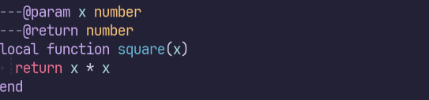
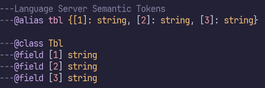
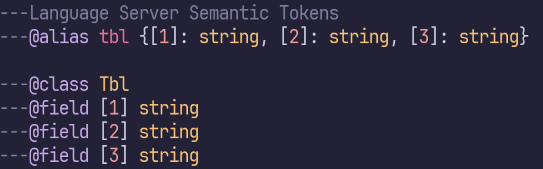

```{r setup, include=FALSE}
knitr::opts_chunk$set(comment = "#>", collapse = TRUE)
set.seed(123)
options(digits.secs = 0)
```

Language Server Protocol（LSP）は、現代的なIDEらしい機能を実現する上で欠かせない技術の一つです。
わかりやすいところでは定義ジャンプやコード補完などを提供しています。
VSCodeに限らずVimやEmacsなど、様々なエディタで利用できます。

ところでLSPの仕様はSemantic Tokensという、シンタックスハイライトに関する機能も定めています。
多くの場合エディタは別にシンタックスハイライトの機能を持っていますが、LSPを利用することで言語ごとに特化したハイライトを提供できるようになります。

たとえばLua言語はコメントを使って型アノテーションやドキュメントの記述ができます。
このコメント部分はLua言語ではないので、単純なLua言語用のパーサーを使ってはハイライトできません。
これがLSPのSemantic Tokensによってハイライト可能になります。



便利ですね。
しかし、精度には難があるようで、 `---@alias tbl {[1]: string, [2]: string, [3]: string}` のような型アノテーションでは、`[1]`の部分のハイライトに失敗します。
代替案として、`@class`と`@field [1]`を使う方法もありますが、Language Serverの実装に依存して妥協するのはあまり気持ちの良いものではありません。



実は、エディタによっては標準のシンタックスハイライトエンジンを使って、このように複雑なLuaのシンタックスハイライトを実現できるものがあります。

Neovimの採用しているTreesitterはその一つです。
`injectin`という、特定のパターンにマッチした箇所にベースとなる言語とは異なるシンタックスハイライトを適用する機能を持っています。

これにより、Luaのパーサーが必要に応じてLuaDocのパーサーを呼び出し、型アノテーションのシンタックスハイライトを見事に実現しています。



すばら！

エディタの使っている技術に親しんでおくと、こういったワークアラウンドを思いつけるのは強みになりますね。

ちなみに、Treesitterを優先したいからといって、Language Serverを丸ごと無効化する必要はありません。
Neovimであればこんな感じでLua Language ServerのSemantic Tokens機能だけを無効化できます。

```lua
vim.lsp.config.lua_ls = {
	settings = {
		Lua = {
			semantic = { enable = true },
		},
	},
}
```

## ENJOY
