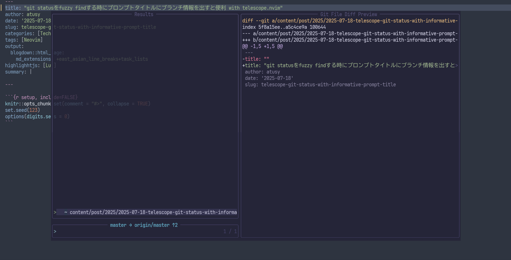

```{r setup, include=FALSE}
knitr::opts_chunk$set(comment = "#>", collapse = TRUE)
set.seed(123)
options(digits.secs = 0)
```

様々なエディタで活躍するfuzzy finder。
これを使うと、ファイルやコマンドを曖昧検索して開いたり実行したりできます。

私はNeovimのファジーファインダープラグインである[telesope.nvim](https://github.com/nvim-telescope/telescope.nvim)を愛用しています。
実際どんなことができるんだろうと気になるかたは、ぜひ以下の記事もご覧ください。

> Neovimのファジーファインダーtelescope.nvimでよく使っているpicker集 \
> <https://blog.atusy.net/2025/03/25/nvim-telescope-pickers/>

さて、ファイルを扱う時には、プロジェクト配下の全ファイルに興味があるとは限らず、時にはGitの差分に注目したいこともありますよね。

上述の記事でも紹介していますが、[telesope.nvim](https://github.com/nvim-telescope/telescope.nvim)には、Gitステータスを扱う機能があります。
`:Telescope git_status`で、変更のあるファイルを開いたり、stage/unstageしたりできます。

ただ、stage/unstageするときに、作業ブランチがあってるか知っておきたいですよね……？

定番の方法はブランチ情報をVimやtmuxのステータスラインに出すことですが、個人的には画面がごちゃっとするので好きではありません。
必要な時に必要な情報をさっと提供するのが好みです。

というわけで、以下のように、`:Telescope git_status`を実行したときに検索プロンプトのタイトルにブランチ情報を出すようにしてみました。
左下のほうに青文字で `master → origin/master ↑2`と出ているのがわかるかと思います。



基本方針は簡単で、起動時に好きなタイトルを指定する仕組みを使います。

```lua
require("telescope.builtin").git_status({
  prompt_title = "好きなタイトル"
})
```

できるだけ簡単にやりたい場合は、ステータスラインプラグイン向けに用意されている関数を使うと便利でしょう。

たとえば[mini.nvim](https://github.com/echasnovski/mini.nvim)なら`section_git`関数があります。

``` lua
require("mini.statusline").section_git({}) --  master
```

私は[vim-gin](https://github.com/lambdalisue/vim-gin)が提供している関数を使っています。

```lua
local function make_title()
  local branch = vim.fn["gin#component#branch#unicode"]()
  local traffic = vim.fn["gin#component#traffic#unicode"]()
  return branch .. " " .. traffic
end
require("telescope.builtin").git_status({
  prompt_title = make_title() -- master → origin/master ↑2
})
```

と、ここまであたかも簡単をよそおいましたが、こだわりだすとそこそこ複雑になります。

- [vim-gin](https://github.com/lambdalisue/vim-gin)は非同期がウリで、Vimの起動直後にはbranchやtrafficの情報取得が間に合わずタイトルが空白になる場合あり
    - `GinComponentPost`イベントで更新可能
- detached HEADの状態ではブランチ情報が殻になる
    - `vim.system`で自前実装
- プロンプトタイトルをハイライトしたい
    - Neovimではウィンドウ単位でハイライトを設定できる機能を利用する
    - ただし、他のプラグイン(styler.nvimなど)経由のハイライト設定と干渉しないように、namespaceをうまく共用する必要あり

これらを叶えるために、`attach_mappings`というTelescopeが起動したタイミングで実行するコールバックを使って実現したのが以下のコードです。
参考にしていただければ幸いです。


```lua
-- ~.config/nvim/lua/plugins/telescope/picker/init.lua

local M = {}

-- 中略

function M.git_status()
	local function _make_title()
		local branch = vim.fn["gin#component#branch#unicode"]()
		if branch == "" or branch == nil then
			local alt = vim.system({ "git", "branch", "--points-at", "HEAD", "--all", "--format=%(refname:short)" })
				:wait()
			if alt.code ~= 0 then
				return nil
			end
			local title = alt.stdout:gsub("\n", " ")
			return title
		end
		local traffic = vim.fn["gin#component#traffic#unicode"]()
		local title = branch .. " " .. traffic
		return title ~= " " and title or nil
	end
	local function make_title()
		local ok, title = pcall(_make_title)
		return ok and title or nil
	end
	require("telescope.builtin").git_status({
		prompt_title = make_title(), -- initial title can be nil and thus requires updates by autocmd
		attach_mappings = function(prompt_bufnr, _)
			local picker = require("telescope.actions.state").get_current_picker(prompt_bufnr)

			-- highlight the prompt title
			local ns = vim.api.nvim_get_hl_ns({ winid = picker.layout.prompt.border.winid })
			if ns == 0 then
				ns = vim.api.nvim_create_namespace("atusy.telescope_git_status")
				vim.api.nvim_win_set_hl_ns(picker.layout.prompt.border.winid, ns)
			end
			vim.api.nvim_set_hl(ns, "TelescopePromptTitle", { link = "Title" })

			-- create autocmds
			local augroup = vim.api.nvim_create_augroup("atusy.telescope_git_status", { clear = true })
			vim.api.nvim_create_autocmd("WinClosed", {
				group = augroup,
				callback = function()
					local win = vim.api.nvim_get_current_win()
					if win == picker.prompt_win then
						vim.api.nvim_del_augroup_by_id(augroup)
					end
				end,
			})
			vim.api.nvim_create_autocmd("User", {
				group = augroup,
				pattern = "GinComponentPost",
				callback = function()
					local title = make_title()
					if title then
						picker.layout.prompt.border:change_title(title)
					end
				end,
			})
			return true
		end,
	})
end

return M

```

## ENJOY!
