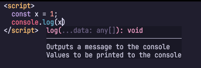

[atusy/kakehashi]: https://github.com/atusy/kakehashi

[kakehashi]: https://github.com/atusy/kakehashi

🌉 [kakehashi] v1をリリースしました！！

こちらからダウンロードできます！

> https://github.com/atusy/kakehashi/releases/tag/v1.0.0

というわけで魅力を紹介させてください。

スターや[スポンサー](https://github.com/sponsors/atusy)もぜひよろしくお願いします。

## kakehashiの魅力

[kakehashi]は様々な言語に対応する汎用言語サーバーです。

### 魅力その1

kakehashiは言語サーバーとしてさまざまな機能を持っていますが、多くの人に感激を与えられる機能を1つ挙げるとしたら、

> マークダウンのコードブロックなどで補完や定義ジャンプといった高度な機能を提供できる

ところでしょう。
[kakehashi]がコードブロックを仮想ファイルとして扱って、Python言語ならPyrightに架け橋するといった動きをしています。

<video controls="controls" autoplay="autoplay" loop="loop" preload="metadata">
  <source src="/2026/01/27/kakehashi/video/demo.mp4" type="video/mp4">
</video>

この動画だけ見ると、マークダウン用の言語サーバーと誤解をうけそうですが、冒頭でも述べた通り「汎用言語サーバー」です。

内部で利用しているパーサーライブラリ（tree-sitter）の力により、埋め込み言語の検出ロジックを拡張可能です。
実際、HTMLファイル中のJavaScriptでsignature helpが効いている様子も確認できます。



設定ファイル（`~/.config/kakehashi/kakehashi.toml`）に以下のように使いたい言語サーバーの起動方法と対象言語を記述すると、Pythonコードブロック上でbasedpyrightの機能が使えます。

```toml
[languageServers.basedpyright]
cmd = ["basedpyright-langserver", "--stdio"]
languages = ["python"]
```

### 魅力その2

kakehashi上に言語サーバーの設定を記述できると紹介しましたが、実はこれを通じて

> 言語サーバーの設定をエディタ間で共有できる

という魅力があります。

設定ファイルに以下のような記述を行うと、Markdown中のPythonコードブロックだけでなく、Pythonファイルそのものもkakehashiを通じてbasedpyrightに繋ぐことができます。
既に様々な言語サーバーを利用している人にとってこの機能は干渉しやすいので、opt-inとして提供しています。

```toml
# 全言語のデフォルトを有効に変更
[languages._.bridge._self]
enabled = true

# 特定言語で有効
[languages.python.bridge._self]
enabled = true
```

これで、どのエディタもkakehashiさえ設定すればよくなります。

それを更に簡単にするためのエディタのエクステンションやプラグインもatusyや有志の手で開発されています。

* VSCode
    * https://marketplace.visualstudio.com/items?itemName=atusy.kakehashi
* VSCode-fork系
    * CursorやPositronなど
    * https://open-vsx.org/extension/atusy/kakehashi/changes
* Neovim
    * <https://github.com/neovim/nvim-lspconfig>
* Vim/Neovim
    * <https://github.com/mattn/vim-lsp-settings>

特にVSCode系は、言語サーバーごとにエクステンションが必要なのが通常ですが、今後はkakehashiのエクステンションさえあれば事足りるのも魅力でしょう。

### 魅力その3 and more

a. 接続する言語サーバーがなくてもリッチな機能が使える
    * syntax highlightや範囲選択については組込み機能として提供
    * 定義ジャンプやリネームは別途tree-sitterクエリの記述が必要
        * 例: https://github.com/atusy/kakehashi/blob/b8116932d034ba2905a434969bf0bbdb6ab945a8/assets/queries/lua/bindings.scm
b. マイナー言語向けの簡易言語サーバーを作れる
    * (a)の延長線上の話として、言語サーバーがない言語であったとしても、tree-sitterのパーサーとクエリを用意することで簡易言語サーバー化可能
c. CLI経由で各種言語サーバーの機能を使ったフォーマット（`kakehashi format`）や診断が可能（`kakehashi diagnose`）

## kakehashiの使い方

これはまた、別の機会に紹介しようと思いますが、[ドキュメント](https://github.com/atusy/kakehashi/blob/main/docs/README.md)にまとめてあるので、興味があれば覗いてみてください。
AIに設定させてみるのも手です。

私の設定は以下にありますが、エディタ依存のない設定ができるよと言いつつ、kakehashiの設定をNeovim内に書いてしまってるので、うまく卒業させてたいです。

* kakehashi本体の設定
    * https://github.com/atusy/dotfiles/blob/main/dot_config/kakehashi/kakehashi.toml
* Neovimの設定
    * https://github.com/atusy/dotfiles/blob/main/dot_config/nvim/after/lsp/kakehashi.lua

ちなみにkakehashiを入れることで、Neovimから直接アクセスする言語サーバーはkakehashiとcopilotだけになりました。

## ENJOY!!

あらためて、スポンサーよろしくお願いします！！

> https://github.com/sponsors/atusy

v1リリースこそしたものの、まだまだ実装したい機能がいっぱいです！！

最後に、本記事は8/19の[Vim 駅伝](https://vim-jp.org/ekiden/)の記事に登録しています。
